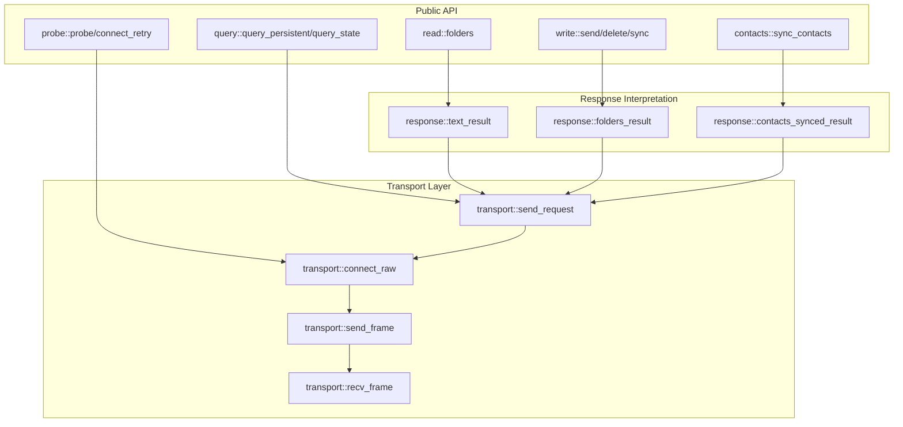

# Broker Client Architecture

The broker client is the counterpart to the broker itself—a shared library that every consumer (CLI, GUI, or any future front-end) uses to communicate with a running broker process over the inter-process communication channel. Understanding how this client works requires examining three interconnected concerns: the transport layer that moves bytes between processes, the response handling that interprets those bytes into meaningful results, and the error taxonomy that tells callers whether a failure originated in the transport or in the broker's processing of the request.

## Layered Design

The client is organized into distinct modules that reflect a clear separation of concerns:



At the bottom sits `transport`, which handles the raw mechanics of connecting to the broker's abstract socket and sending or receiving length-delimited JSON frames. Above it, `response` provides functions that interpret a `BrokerResponse` into either a typed success value or a `CallError` describing what went wrong inside the broker. The public API modules—`read`, `write`, `contacts`, `query`, and `probe`—combine these two layers to expose operation-specific functions with appropriately typed results and errors.

This layering is deliberate. The transport logic is the same regardless of whether you're sending a message, listing folders, or querying the broker's state. The response interpretation is also uniform: every request either succeeds with its expected response shape or fails with one of a small number of error conditions. By factoring these into shared modules, the client avoids duplicating connection logic and response matching across every operation.

## Transport: Frames Over Abstract Sockets

The broker uses Linux abstract sockets as its communication medium—a namespace-local socket that doesn't require filesystem paths and automatically disappears when the broker process exits. The transport layer (`transport.rs`) builds on `tokio-util`'s `LengthDelimitedCodec` to frame messages:

```rust
pub async fn send_request(addr: &str, req: BrokerRequest) -> Result<BrokerResponse> {
    let mut framed = connect_raw(addr).await?;
    send_frame(&mut framed, &req).await?;
    recv_frame(&mut framed).await
}
```

Each request follows a simple pattern: connect, send one frame, receive one frame, disconnect. This is a stateless request-response model—the broker processes one request at a time, and concurrent CLI invocations queue in the kernel's accept backlog (see `ipc::proto::BrokerRequest` documentation for details).

The use of length-delimited framing is significant. JSON alone is ambiguous at stream boundaries: if you write two JSON objects back-to-back, a reader has no way to know where one ends and the next begins. Length-delimited framing solves this by prefixing each frame with its byte length, so the reader knows exactly how many bytes to read for each complete JSON object. The `MAX_FRAME_LEN` constant (64 KB) is enforced identically on both ends, preventing malicious or malformed frames from consuming unbounded memory.

The `connect_raw` function derives the abstract socket name from the device address using a configuration helper:

```rust
pub(crate) async fn connect_raw(addr: &str) -> Result<Framed<LocalStream, LengthDelimitedCodec>> {
    let name = config::broker_abstract_name(addr).context("building broker socket name")?;
    let stream = ConnectOptions::new().name(name).connect_tokio().await.context("connecting to broker")?;
    let codec = LengthDelimitedCodec::builder().max_frame_length(MAX_FRAME_LEN).new_codec();
    Ok(Framed::new(stream, codec))
}
```

This design means the client doesn't need to know whether it's talking to an ephemeral one-shot broker or a persistent daemon—both bind to the same abstract socket name derived from the device address. The distinction between them emerges only in the response, as we'll see in the query module.

## Response Handling: From Wire Format to Typed Results

The wire format uses a tagged enum (`BrokerResponse`) with variants for every possible response shape. A caller that expects `BrokerResponse::Text` but receives `BrokerResponse::Failed` needs to know that this is an error, and more specifically, a device-level failure rather than a transport failure. The `response` module provides extractor functions that perform this interpretation:

```rust
pub fn text_result(resp: BrokerResponse) -> Result<String, CallError> {
    match resp {
        BrokerResponse::Text(s) => Ok(s),
        BrokerResponse::Failed(reason) => Err(CallError::Failed(reason)),
        BrokerResponse::Error(e) => Err(CallError::Error(e)),
        other => Err(CallError::Unexpected(Box::new(other))),
    }
}
```

This pattern appears in three variants: `text_result` for operations that return a human-readable string, `folders_result` for folder listings, and `contacts_synced_result` for contact sync reports. Each one matches the response variant, extracting the success case or mapping failure cases to the appropriate `CallError` variant.

The `CallError` enum captures three distinct failure modes:

- **`Failed(Reason)`**: The broker reached the device, but the device or the MAP/PBAP session rejected the operation. The `Reason` type (defined in the IPC crate) carries typed, action-oriented reasons like `DeviceUnreachable` or `PermissionDenied`.
- **`Error(String)`**: An IPC-plumbing failure inside the broker—malformed frames, broker shutting down, serialization errors. This is distinct from a device failure; it indicates something went wrong in the middleware layer itself.
- **`Unexpected(Box<BrokerResponse>)`**: The response shape doesn't match what the caller expected. This guards against programming errors where, for example, a function expecting folders receives a `Messages` response.

This taxonomy matters because callers handle these failures differently. A `Failed` error might prompt the user to check their Bluetooth connection; an `Error` might prompt them to restart the daemon; an `Unexpected` is a bug that should crash with a useful diagnostic.

## Error Architecture: Connect vs. Call

Every public API function returns an error type that combines two failure sources:

```rust
pub enum ReadError {
    #[error("{0}")]
    Connect(#[from] anyhow::Error),
    #[error(transparent)]
    Call(#[from] CallError),
}
```

The `Connect` variant wraps transport-level failures: the broker socket doesn't exist, the connection was refused, the frame was malformed, or JSON deserialization failed. These are `anyhow::Error` because they represent infrastructure failures that don't warrant their own typed variants—the caller typically can't recover from a connect error except by retrying or giving up.

The `Call` variant carries `CallError`, which as described above, represents failures that originated inside the broker after a successful connection. These are typed because the caller may need to make decisions based on the failure reason—displaying different messages, retrying with different parameters, or escalating to the user.

This two-level error structure appears consistently across `ReadError`, `WriteError`, and `ContactsError`. The `query` and `probe` modules differ slightly: they return `Option` types rather than errors when the broker is unreachable, because an absent broker is a valid state that callers need to handle gracefully (for example, to decide whether to spawn a new broker).

## Operation Categories

The public API modules demonstrate how the transport and response layers combine for different use cases:

**Read operations** (`read.rs`) query the live device for folder listings. They use `send_request` to send a `BrokerRequest::Folders` and `folders_result` to interpret the response. The comment in the module notes that these are shared helpers so the CLI and GUI read the device through the same code path rather than each interpreting the protocol themselves.

**Write operations** (`write.rs`) send, delete, or sync messages. These always go through the broker because the broker holds the sole `MapClient`—there's no way for a client to bypass the broker and talk to the device directly. They return `text_result` because the broker responds with a human-readable status string.

**Contact operations** (`contacts.rs`) sync the local contacts cache from the device. This is the one PBAP write operation, analogous to the write operations in `write.rs`. It returns `contacts_synced_result` because the response carries a structured `SyncReportDto` describing what the sync did.

**Query operations** (`query.rs`) ask the broker about itself: is it running in persistent daemon mode? what's its current session state? These use the transport layer directly rather than `send_request` because they need to inspect the `StatusInfo` response's `persistent` field to distinguish a daemon from an ephemeral broker that happens to be holding the socket.

**Probe operations** (`probe.rs`) check whether the broker is reachable at all, without sending a request. The `probe` function does a raw connect; `connect_retry` waits for a spawned broker to become ready, handling the race between process startup and socket availability.

## Design Rationale

Several design decisions shaped this architecture:

**One-shot connections**: Each request establishes a fresh connection, sends one frame, receives one frame, and disconnects. This avoids the complexity of connection pooling, session management, and reconnection logic in the client. The broker handles concurrency through its accept backlog, not through multiplexed connections. This choice trades some latency (the TCP handshake cost per request) for simplicity and robustness—the client doesn't need to track connection state.

**Abstract sockets**: Using Linux abstract sockets rather than filesystem-backed Unix domain sockets means the socket doesn't persist in the filesystem, doesn't require cleanup on crash, and automatically becomes unavailable when the broker exits. This makes the "is the broker running?" question easy to answer: if you can connect, it's there; if you can't, it's not.

**Length-delimited JSON**: JSON is human-readable for debugging, which matters for an IPC protocol that developers need to inspect. Length-delimited framing makes the stream self-delimiting without requiring a more complex protocol like HTTP with its chunked encoding or WebSocket framing. The 64 KB limit is large enough for any realistic SMS body and provides a sane bound against malicious input.

**Shared response interpretation**: Rather than having each caller match over `BrokerResponse` variants, the `response` module centralizes this logic. This ensures consistent handling of edge cases—for example, an empty folder listing is a successful result (`BrokerResponse::Folders([])`), not an error, and the extractor functions encode this invariant.

**Two-level errors**: The separation between connect errors and call errors reflects a fundamental distinction in failure modes. Transport failures are usually transient (the broker isn't running yet) or fatal (the system is broken). Broker-level failures are usually recoverable (the device disconnected) or actionable (the user needs to do something). Typed errors let callers make these distinctions without parsing error strings.

## Relationship to Other Components

The broker client depends on the `ipc` crate for the wire types (`BrokerRequest`, `BrokerResponse`, `Reason`, `SessionState`, `MAX_FRAME_LEN`). This crate defines the protocol contract that both broker and client must implement. The client doesn't know about the broker's internal architecture—it only knows the request and response types.

The client doesn't handle process spawning; that's the domain of `imsg-proc`, which knows how to spawn the broker executable and wait for it to become ready. The `probe` module works with an already-spawned process, not the spawning itself.

The presentation layer—human-readable output formatting—stays in each binary (CLI or GUI). The client returns typed data (`Vec<FolderDto>`, `String`, `SyncReportDto`) that each front-end can format as appropriate for its context.

## Summary

The broker client architecture reflects a pragmatic balance between simplicity and robustness. The transport layer handles the mechanics of talking to an abstract socket with length-delimited JSON frames. The response layer interprets the broker's answers into typed results or structured errors. The public API modules combine these layers with operation-specific result types, ensuring that every consumer of the broker protocol handles failures consistently and presents typed data to its own users.

This separation means the transport logic is written once, the response interpretation is consistent across all operations, and each public function is a thin composition of these shared components. Future operations will follow the same pattern: add a variant to `BrokerRequest` and `BrokerResponse` in the IPC crate, add an extractor function in `response` if needed, and expose a public function that composes transport and interpretation.