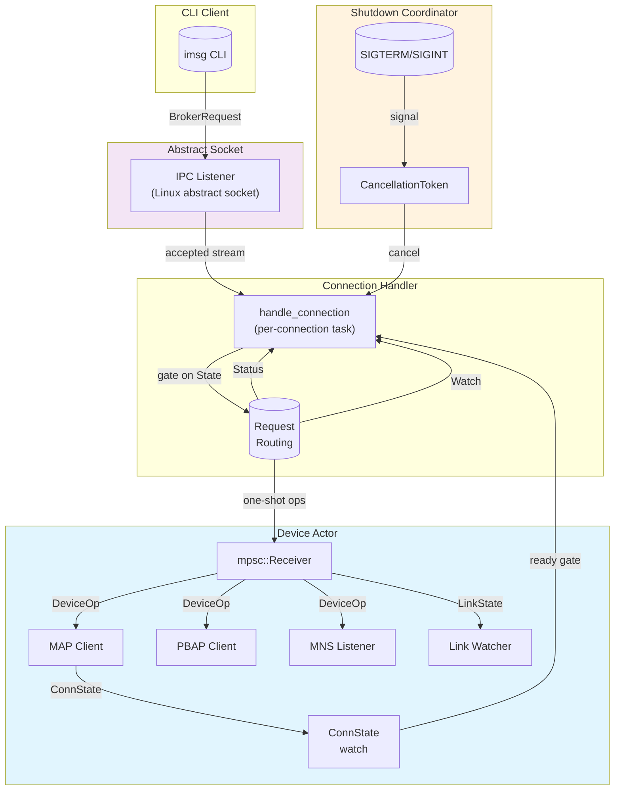

# Broker Daemon Architecture

The broker daemon is the runtime engine that mediates between CLI clients and the Bluetooth device. It owns the MAP (Messaging Access Profile) and PBAP (Phonebook Access Profile) sessions, handles IPC connections from clients, and manages the lifecycle of these sessions across connect, reconnect, and idle phases. Understanding this architecture requires examining how the abstract socket election works, how the device actor serializes operations, and how the system distinguishes between ephemeral one-shot operation and persistent daemon mode.

## The Runtime Boundary

The broker runtime lives entirely within the `imsg-broker` crate's private boundary. The only public entry point is `crate::run`, which the CLI binary calls. This boundary is deliberate: the runtime's internal types—`DeviceOp`, `ConnState`, `ActorHandles`, `ConnectPolicy`—are implementation details that never escape the crate. The runtime owns the socket lifecycle, the actor spawning, and the shutdown coordination, presenting only an async function signature to callers.

```rust
// crates/imsg-broker/src/runtime/mod.rs (lines 36-39)
pub async fn run(cfg: Config, device_override: Option<String>, store: Store) -> Result<()> {
    let (addr_str, addr, map_channel, listener) = bind(&cfg, device_override.as_deref(), true)?;
    server::serve(cfg, addr_str, addr, map_channel, store, listener).await
}
```

This design keeps the public API minimal while allowing the internal modules—`actor`, `server`, `handler`, `shutdown`, `types`—to evolve independently.

## Abstract Socket Binding and Single-Instance Election

The broker binds to a Linux abstract socket rather than a filesystem path. This choice is fundamental to the system's reliability: abstract sockets are automatically released by the kernel when the process exits, including on crash or SIGKILL. There is no socket file to clean up, no stale inode problem, and no need for lock files or PID files.

The socket name encodes the target device address, ensuring that multiple devices mean multiple independent broker instances:

```rust
// crates/imsg-broker/src/runtime/server/mod.rs (lines 42-56)
pub(in crate::runtime) fn bind_or_exit(addr: &str, allow_silent_exit: bool) -> Result<IpcListener> {
    let name = config::broker_abstract_name(addr).context("constructing abstract socket name")?;
    match ListenerOptions::new().name(name).create_tokio() {
        Ok(l) => Ok(l),
        Err(e) if e.kind() == std::io::ErrorKind::AddrInUse && allow_silent_exit => {
            tracing::info!("broker already running for {addr} — exiting");
            std::process::exit(0);
        }
        // ...
    }
}
```

The `EADDRINUSE` error from the kernel serves as an atomic single-instance election. When `allow_silent_exit` is `true` (ephemeral mode), a lost race exits cleanly with status 0—the assumption being that another broker is already serving. When `allow_silent_exit` is `false` (daemon mode), the same error returns an error instead, because silently exiting 0 would be indistinguishable from a successful start to a process supervisor using `RestartPolicy::OnFailure`.

This is a deliberate design choice: the ephemeral broker (called by CLI commands) can afford to lose the race because the winning instance will handle the request. The persistent daemon cannot, because a service manager needs to know whether it actually started.

## The Device Actor

At the heart of the runtime is the device actor—a tokio task that owns the MAP session and serves `DeviceOp` messages from connection tasks. The actor pattern solves several concurrency problems simultaneously:

1. **Serialization**: All MAP operations go through a bounded `mpsc` channel, ensuring that concurrent CLI commands queue behind the active request rather than racing on the RFCOMM socket.
2. **State publication**: The actor publishes `ConnState` over a `watch` channel, allowing connection tasks to gate operations on readiness without holding the actor's attention.
3. **Lifecycle ownership**: The actor decides when to connect, reconnect, or exit—connection tasks simply send ops and wait for responses.

```rust
// crates/imsg-broker/src/runtime/actor/mod.rs (lines 76-112)
pub(in crate::runtime) fn spawn<T>(
    connector: Connector<T>,
    pbap_connector: PbapConnector<T>,
    link_watch: LinkWatcher,
    store: Store,
    idle: Option<Duration>,
    policy: ConnectPolicy,
) -> ActorHandles
where
    T: tokio::io::AsyncRead + tokio::io::AsyncWrite + Unpin + Send + 'static,
{
    let (op_tx, op_rx) = mpsc::channel(16);
    let (watch_tx, _initial_rx) = broadcast::channel(64);
    let (state_tx, state_rx) = watch::channel(ConnState::Connecting);
    let (shutdown_tx, shutdown_rx) = watch::channel(None);
    // ... spawns actor task
    ActorHandles { handle: DeviceHandle { tx: op_tx }, state: state_rx, shutdown: shutdown_rx }
}
```

The actor holds the MAP client as a local variable in its run loop, not as a field. This allows the client to be threaded down to `handle_op` by `&mut` without conflicting with `&self` borrows like `self.store`. The same pattern applies to the PBAP session, which is also a local that lives across reconnect cycles.

### Connection Lifecycle

The actor's `run` method in `inner.rs` implements a connect → serve → reconnect loop:

```rust
// crates/imsg-broker/src/runtime/actor/inner.rs (lines 35-62)
pub(in crate::runtime::actor) async fn run(mut self) {
    if wants_mns(self.watch_count, self.idle) {
        self.start_mns().await;
    }
    let mut pbap: Option<PbapClient<T>> = None;
    let reason = loop {
        let client = match self.try_connect().await {
            Ok(c) => c,
            Err(reason) => {
                let _ = self.state_tx.send(ConnState::Failed(reason.clone()));
                self.fail_pending(&reason);
                break TerminalReason::PermanentFailure(reason);
            }
        };
        if !self.run_session(client, &mut pbap).await {
            break TerminalReason::Requested;
        }
    };
    // ... disconnect and publish reason
}
```

Key behaviors:
- **Lazy MAP session**: The actor establishes the MAP session lazily, so the abstract socket is bindable and reachable before the slow Bluetooth connection completes.
- **Bounded retry**: The `ConnectPolicy` specifies initial backoff, max backoff, max attempts, and an optional startup budget. Ephemeral mode uses a wall-clock budget so CLI commands fail fast; daemon mode has no budget and retries indefinitely.
- **Independent fault domains**: PBAP failures are scoped to PBAP alone and never affect the MAP session's `ConnState`. A lost PBAP session reconnects independently; a lost MAP session triggers the actor's reconnect logic.

### Connection State

The `ConnState` enum captures the actor's lifecycle phase:

```rust
// crates/imsg-broker/src/runtime/types.rs (lines 112-122)
pub(in crate::runtime) enum ConnState {
    Connecting,   // Establishing the session
    Active,       // Session live; operations may run
    Reconnecting, // Session dropped; backoff before next attempt
    Failed(Reason), // Terminal: budget exhausted or permanent error
}
```

This state is published on a `watch` channel and read by connection tasks to gate operations. The terminal `Failed` state carries a `Reason` so that connection tasks can return a precise failure to held requests.

## IPC Request Handling

Each accepted connection runs in its own task, handled by `handle_connection` in `handler.rs`. The handler reads one request frame, routes it, and responds:

```rust
// crates/imsg-broker/src/runtime/handler.rs (lines 55-67)
match req {
    BrokerRequest::Status => {
        // Served straight from the state watch — no actor involvement
        let info = BrokerResponse::StatusInfo { state: state.borrow().to_wire(), device, persistent };
        send_frame(&mut framed, &info).await
    }
    BrokerRequest::Watch => handle_watch(framed, handle, shutdown).await,
    BrokerRequest::Shutdown => handle_shutdown(framed, shutdown).await,
    other => handle_one_shot(framed, handle, state, readiness_wait, other).await,
}
```

Three request types are handled specially:
- **Status**: Served directly from the `ConnState` watch, bypassing the actor entirely. This ensures that even when the actor is busy or the session is down, clients can query the broker's state without排队.
- **Watch**: Delegates to the watch connection handler, which subscribes to the broadcast channel for MNS events.
- **Shutdown**: Only available in daemon mode. Cancels the shutdown coordinator's `CancellationToken`.

All other requests go through `handle_one_shot`, which gates on readiness:

```rust
// crates/imsg-broker/src/runtime/handler.rs (lines 117-125)
match await_ready(&mut state, readiness_wait).await {
    Ready::Active => {}
    Ready::Failed(reason) => return send_frame(&mut framed, &BrokerResponse::Failed(reason)).await,
    Ready::Timeout => return send_frame(&mut framed, &BrokerResponse::Failed(Reason::NotReady)).await,
}
```

The `readiness_wait` deadline comes from the config and bounds how long a one-shot request will wait for the session to become `Active`. If the deadline passes, the request fails with `Reason::NotReady` rather than hanging indefinitely.

## Ephemeral vs. Persistent Mode

The broker supports two operational modes that share most of their code but differ in critical ways:

| Aspect | Ephemeral (`run`) | Persistent (`run_daemon`) |
|--------|-------------------|---------------------------|
| Idle timeout | `Some(cfg.broker.idle())` — exits after inactivity | `None` — runs indefinitely |
| Startup budget | `Some(duration)` — fails fast if device unreachable | `None` — retries forever |
| Shutdown | Plain accept loop; actor exits on idle or drop | Coordinated drain via `shutdown::run` |
| `Shutdown` IPC | Returns an error (no coordinator) | Cancels the coordinator token |
| Exit on race | Silent exit(0) — another broker is serving | Error — service manager needs to know |

The `idle` parameter is the most visible difference. In ephemeral mode, the broker exits after a configurable period with no incoming `DeviceOp`. This is appropriate for CLI usage: once a command completes, there's no reason to keep the broker running. In daemon mode, `idle` is `None`, and the broker survives indefinitely with zero subscribers.

```rust
// crates/imsg-broker/src/runtime/server/mod.rs (lines 74-76)
pub(in crate::runtime) async fn serve(...) -> Result<()> {
    let idle = Some(cfg.broker.idle());
    serve_with_idle(cfg, device, addr, channel, store, listener, idle).await
}
```

The daemon mode also uses a different connect policy:

```rust
// crates/imsg-broker/src/runtime/server/connectors.rs (lines 17-36)
pub(in crate::runtime) const fn build_policy(cfg: &Config) -> ConnectPolicy {
    ConnectPolicy { startup_budget: Some(cfg.broker.startup_budget()), ... }
}

pub(in crate::runtime) const fn build_daemon_policy(cfg: &Config) -> ConnectPolicy {
    ConnectPolicy { startup_budget: None, max_attempts: u32::MAX, ... }
}
```

## Graceful Shutdown in Daemon Mode

The `shutdown` module implements coordinated shutdown for the persistent daemon. It converges three shutdown triggers—IPC `Shutdown` request, SIGTERM, and SIGINT—onto a single `CancellationToken`:

```rust
// crates/imsg-broker/src/runtime/shutdown.rs (lines 60-113)
async fn accept_and_drain(handles: ActorHandles, listener: IpcListener, ...) -> Result<()> {
    // ... spawn actor, start accept loop
    run_accept_loop(&handle, &state, &mut shutdown, cfg).await?;
    
    // Drop listener immediately — don't let it sit in the kernel backlog
    drop(listener);
    
    // Drop handle to signal actor to exit
    drop(handle);
    tasks.close();
    let _ = tokio::time::timeout(DRAIN_TIMEOUT, tasks.wait()).await;
    let _ = tokio::time::timeout(DRAIN_TIMEOUT, shutdown.wait_for(Option::is_some)).await;
    
    // Distinguish permanent failure from clean shutdown
    match reason {
        Some(TerminalReason::PermanentFailure(reason)) => Err(...),
        _ => Ok(()),
    }
}
```

The shutdown sequence is deliberate:
1. Stop accepting connections immediately by dropping the listener, so a racing client gets a clean refusal rather than queuing into a backlog no one will ever accept.
2. Wait for in-flight connections to complete (bounded by `DRAIN_TIMEOUT`).
3. Drop the actor handle, signaling the actor to disconnect and exit.
4. Wait for the actor to confirm exit.
5. Return an error if the exit was due to `PermanentFailure`, so the process exits non-zero and the service manager knows something went wrong.

## MNS and Event Notification

The Message Notification Service (MNS) is a Bluetooth mechanism where the phone pushes notifications to the broker when new messages arrive. The broker must have an RFCOMM listener registered with BlueZ *before* the MAP session enables notifications—otherwise the phone connects back to find nothing there.

```rust
// crates/imsg-broker/src/runtime/actor/inner.rs (lines 36-38)
pub(in crate::runtime::actor) async fn run(mut self) {
    if wants_mns(self.watch_count, self.idle) {
        self.start_mns().await;
    }
    // ... rest of lifecycle
}
```

The `wants_mns` function determines whether MNS should be running:

```rust
// crates/imsg-broker/src/runtime/actor/serve/mns.rs
pub(in crate::runtime::actor) fn wants_mns(watch_count: u32, idle: Option<Duration>) -> bool {
    // In daemon mode (idle: None), MNS always runs.
    // In ephemeral mode, MNS runs only when there are active Watch subscribers.
    idle.is_none() || watch_count > 0
}
```

In daemon mode, MNS starts once at actor startup and stays running. In ephemeral mode, MNS starts on the first `Watch` subscription and stops when the last subscriber unsubscribes. This is efficient: a CLI command that just sends a message doesn't need MNS, but a long-running `imsg watch` process does.

## Link Watching

The actor subscribes to link-state events from BlueZ to detect when the Bluetooth device moves out of range without waiting for a MAP operation to fail:

```rust
// crates/imsg-broker/src/runtime/actor/serve/mod.rs (lines 46-57)
if self.link.is_none() {
    self.link = Some(self.resubscribe_link().await);
}
tokio::select! {
    maybe_link = recv_link(&mut self.link) => match maybe_link {
        Some(LinkState::Down) => return ServeOutcome::Dropped,
        Some(LinkState::Up) => {}
        None => self.link = None, // Stream ended; resubscribe
    },
    // ... handle MNS and ops
}
```

If the link goes down, the actor treats it as a session drop and enters the reconnect phase (if subscribers remain or in daemon mode) or exits (if no subscribers in ephemeral mode).

## Architectural Summary

The broker daemon architecture can be visualized as a set of interacting components:



The key architectural decisions that make this work:

1. **Abstract sockets for single-instance election**: The kernel's `EADDRINUSE` on abstract names is an atomic race winner, eliminating the need for lock files or cleanup logic.
2. **Actor pattern for serialization**: All MAP operations flow through a single task, preventing RFCOMM races while allowing the actor to own the connection lifecycle.
3. **Lazy session establishment**: The MAP session connects after the socket is bound, so the broker is reachable before Bluetooth completes.
4. **Independent fault domains**: PBAP and MAP are separate sessions with separate retry logic; one can fail without affecting the other.
5. **Readiness gating**: One-shot requests wait for `Active` state but fail fast on timeout, balancing responsiveness with liveness.
6. **Daemon vs. ephemeral wiring**: The same core code serves both modes, with `idle` and `startup_budget` as the distinguishing parameters.
7. **Graceful drain**: The shutdown coordinator ensures that stopping the daemon doesn't leave connections hanging or confuse process supervisors.

These decisions collectively ensure that the broker is reliable in both CLI one-shot usage (where it must fail fast and clean up after itself) and long-running daemon usage (where it must survive transient failures and coordinate shutdown with service managers).