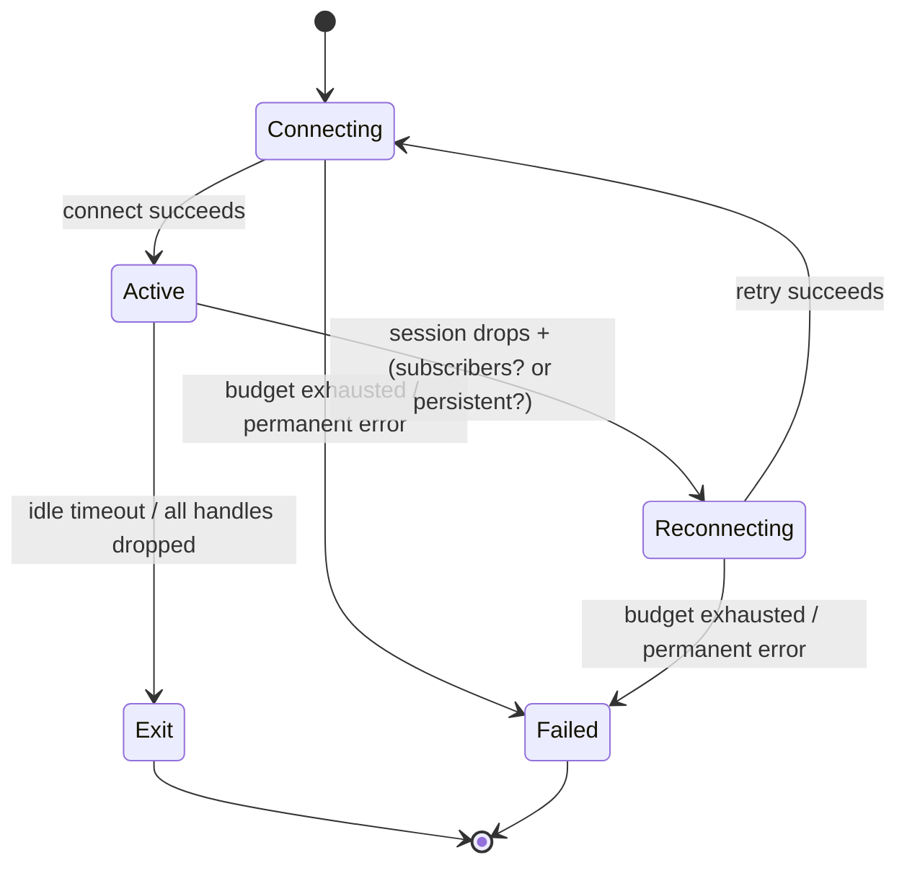

# Device Actor Lifecycle

The device actor is the central coordinator for all communication with a Bluetooth device. It owns the MAP (Message Access Profile) session for its entire lifetime, manages the PBAP (Phone Book Access Profile) session lazily, and decides when to connect, reconnect, or exit based on operational state and mode. Understanding this lifecycle illuminates how the broker balances responsiveness against resilience, and why certain failure modes lead to retry while others terminate the session entirely.

## The Actor's Responsibility Boundary

The device actor sits at the boundary between the IPC layer (which speaks to CLI clients) and the Bluetooth transport (which speaks MAP and PBAP to the phone). It receives operation requests through an `mpsc` channel, executes them against the live MAP client, and returns responses. This serialization is intentional: MAP is a single-channel protocol, and concurrent operations would interfere with each other.

The actor is generic over the stream type `T`, accepting any `AsyncRead + AsyncWrite + Unpin + Send + 'static`. This abstraction enables the test suite to run the full lifecycle against in-memory duplex streams without touching real Bluetooth hardware. The production path passes BlueZ RFCOMM streams; the test path passes `tokio::io::DuplexStream`.

## Lazy Connection and the Startup Budget

The actor establishes its MAP session **lazily**. When the broker starts, it binds the abstract socket and begins accepting IPC connections immediately—before the Bluetooth connection completes. This design serves two purposes:

1. **Perceived latency**: The broker is ready to receive requests as soon as it starts, rather than blocking the entire startup on a potentially slow Bluetooth handshake.
2. **Separation of concerns**: The IPC listener and the MAP connector are independent; a failure in one doesn't affect the other.

The `ConnectPolicy` controls the connection behavior:

```rust
pub struct ConnectPolicy {
    pub initial_backoff: Duration,    // First retry delay
    pub max_backoff: Duration,        // Ceiling for exponential backoff
    pub max_attempts: u32,            // Maximum attempts per phase
    pub startup_budget: Option<Duration>, // Wall-clock cap on the whole phase
}
```

The `startup_budget` is the critical differentiator between **ephemeral mode** (CLI one-shot) and **persistent mode** (daemon):

- **Ephemeral mode** (`startup_budget: Some(d)`): The actor must connect within `d` wall-clock seconds or give up. This prevents a one-shot command from hanging indefinitely while the device is out of range.
- **Persistent mode** (`startup_budget: None`): The actor retries indefinitely (or until a permanent error), matching the daemon's expectation that it may start before the phone is in Bluetooth range.

The `try_connect` method wraps the connector in this budget:

```rust
async fn try_connect(&mut self) -> Result<MapClient<T>, Reason> {
    Self::within_budget(self.policy.startup_budget, self.connect_with_retry()).await
}
```

If the budget elapses, the actor transitions to `ConnState::Failed` and exits with `TerminalReason::PermanentFailure`, allowing the daemon to exit non-zero and be restarted by a process supervisor.

## Bounded Retry with Exponential Backoff

When a connection attempt fails, the actor classifies the error as **transient** or **permanent**:

- **Transient** (e.g., link timeout, device temporarily out of range): The actor retries with exponential backoff, doubling the delay each attempt up to `max_backoff`.
- **Permanent** (e.g., authentication failure, wrong channel, security level refused): The actor fails fast, returning `Reason::ConnectionRefused` immediately.

The retry logic lives in `retry_connect`:

```rust
async fn retry_connect<C>(policy: ConnectPolicy, connect: &mut dyn FnMut() -> ..., label: &str) -> Result<C, Reason> {
    let mut delays = session::retry::backoff(policy.initial_backoff, policy.max_backoff, policy.max_attempts);
    loop {
        let err = match connect().await {
            Ok(client) => return Ok(client),
            Err(e) => e,
        };
        if session::classify(&err) == Disposition::Permanent {
            return Err(dispatch::connect_reason(&err));
        }
        let Some(d) = delays.next() else {
            return Err(dispatch::connect_reason(&err)); // attempts exhausted
        };
        tokio::time::sleep(d).await;
    }
}
```

The backoff schedule resets each connection phase. When the actor transitions from `Connecting` → `Active` → `Dropped` → `Reconnecting`, it starts a fresh schedule rather than continuing where it left off. This prevents a device that's briefly out of range from exhausting its retry budget during the initial connect phase, only to fail immediately on the first reconnect attempt.

## Reconnect on Recoverable Drops

Once active, the actor serves operations until one of three things happens:

1. **Idle timeout fires** (`ServeOutcome::Exit`): No operations arrived for the configured duration. The actor shuts down cleanly.
2. **All handles dropped** (`ServeOutcome::Exit`): Every `DeviceHandle` clone has been dropped, meaning no client cares about this device anymore.
3. **Session dies mid-operation** (`ServeOutcome::Dropped`): A fatal transport error occurred during an operation, or the link watcher reported `LinkState::Down`.

On a `Dropped` outcome, the actor checks whether to reconnect:

```rust
ServeOutcome::Dropped if !wants_mns(self.watch_count, self.idle) => {
    // No subscribers and not persistent mode — exit, respawn lazily
    false
}
ServeOutcome::Dropped => {
    // Subscribers exist or persistent mode — reconnect
    let _ = self.state_tx.send(ConnState::Reconnecting);
    true
}
```

The `wants_mns` function determines whether anyone needs the link:

```rust
pub const fn wants_mns(watch_count: u32, idle: Option<Duration>) -> bool {
    watch_count > 0 || idle.is_none()
}
```

This is the **demand gate**: in ephemeral mode, if no `Watch` subscribers exist and the idle timeout fires (or the session drops), the actor exits. The CLI can respawn it lazily on the next request. In persistent mode (`idle: None`), the actor always reconnects because the daemon is expected to maintain a persistent connection regardless of client interest.

## Link Watching: Detecting Drops Without Traffic

The actor subscribes to link-state transitions from the transport (`LinkWatcher`), not just from operation failures. This matters because a Bluetooth link can drop silently while the actor is idle—no operation is running to discover the problem.

```rust
tokio::select! {
    maybe_link = recv_link(&mut self.link) => match maybe_link {
        Some(LinkState::Down) => return ServeOutcome::Dropped,
        Some(LinkState::Up) => {}
        None => self.link = None, // stream ended, resubscribe
    },
    // ... other branches
}
```

When the link goes down, the actor treats it the same as a fatal transport error: it attempts to reconnect if conditions allow. If the link stream ends (the transport can no longer report), the actor resubscribes with a small backoff (`LINK_RESUBSCRIBE_BACKOFF`) to avoid spinning at full speed on a transport that hands back an already-ended stream.

## Independent Fault Domains: MAP and PBAP

The actor manages two Bluetooth sessions with different characteristics:

| Property | MAP | PBAP |
|----------|-----|------|
| **Lifecycle** | Owned for the actor's entire lifetime | Lazy: connected on first use, held across operations |
| **Push notifications** | Yes: MNS (Message Notification Service) | No |
| **Reconnect behavior** | Full retry policy on drop | Independent: a PBAP drop never triggers MAP reconnect |
| **Failure scope** | Affects the whole actor | Scoped to PBAP ops only |

The PBAP session lives as a local variable in the `run` loop, not a field of the `Actor` struct:

```rust
let mut pbap: Option<PbapClient<T>> = None;
// ... connect MAP ...
let outcome = self.run_session(client, &mut pbap).await;
```

This design reflects the independent fault domains: a lost MAP session doesn't imply a lost PBAP session, and vice versa. If PBAP drops mid-operation, the actor reconnects it lazily on the next PBAP request without disturbing the MAP session. Conversely, a MAP drop triggers a full reconnect cycle that doesn't touch PBAP.

The `ensure_pbap` method implements this lazy connect:

```rust
pub async fn ensure_pbap(&mut self, pbap: &mut Option<PbapClient<T>>) -> Result<(), Reason> {
    if pbap.is_none() {
        *pbap = Some(self.pbap_try_connect().await?);
    }
    Ok(())
}
```

A failed PBAP connect returns a `Reason` that the caller converts to `BrokerResponse::Failed`—it never affects `ConnState` or the MAP session's liveness.

## MNS and the Subscriber Count

The Message Notification Service (MNS) is the MAP push channel: when a new message arrives on the phone, the phone pushes an event to the broker over the MNS RFCOMM connection. The actor must register the MNS profile with BlueZ **before** the MAP session enables notifications, otherwise the phone connects back to find nothing there.

The actor starts MNS in one of two ways:

1. **Persistent mode**: MNS starts once at actor startup, before the first MAP connect, and stays running across all reconnects.
2. **Ephemeral mode**: MNS starts on the first `Watch` subscription and stops when the last subscriber drops.

This is why `wants_mns` checks both `watch_count > 0` (ephemeral: someone is listening) and `idle.is_none()` (persistent: always keep MNS running).

When MNS events arrive, they are written to the store and fanned out to `Watch` subscribers unconditionally—even if the store write fails. The event is not retried; `Store::reconcile_outgoing` and periodic backfill are the correctness fallbacks for anything missed.

## Exit Conditions: When the Actor Terminates

The actor exits with one of two `TerminalReason` values:

- **`Requested`**: Idle timeout, external shutdown, or a demand-gated exit (session drop with no subscribers in ephemeral mode). This is a clean exit.
- **`PermanentFailure(Reason)`**: The connect phase exhausted its retry budget or hit a permanent error before ever reaching `Active`. The daemon uses this to exit non-zero, distinguishing a genuine failure from a clean stop.

The shutdown path publishes the reason over a `watch` channel so the caller (either the ephemeral server or the persistent daemon) can decide how to interpret the exit:

```rust
match reason {
    Some(TerminalReason::PermanentFailure(reason)) => {
        Err(anyhow::anyhow!("daemon stopped: unrecoverable MAP failure: {reason:?}"))
    }
    _ => Ok(()),
}
```

This distinction matters for process supervisors (systemd, etc.): a daemon that exits non-zero on permanent failure looks different from one that exits zero on a clean stop, allowing the supervisor to take action (restart, alert, etc.).

## Lifecycle State Machine

The actor publishes its state over a `watch` channel so connection tasks can gate operations and serve `Status` without accessing the op channel:

```rust
pub enum ConnState {
    Connecting,    // Establishing the session
    Active,        // Session live; operations may run
    Reconnecting, // A live session dropped; backoff running
    Failed(Reason), // Terminal: budget exhausted or permanent error
}
```

The state transitions form a simple machine:



The `Reconnecting` state is transient: it exists so clients polling `Status` can distinguish "trying to reconnect" from "idle but healthy" or "permanently failed."

## Summary

The device actor lifecycle is shaped by two competing pressures: the need for resilience (retrying transient failures, reconnecting on drops) and the need for responsiveness (not blocking startup on Bluetooth, exiting promptly when no one cares). The design addresses these through:

- **Lazy connection**: The IPC layer is ready before Bluetooth completes.
- **Bounded retry with exponential backoff**: Transient failures retry within limits; permanent failures fail fast.
- **Demand-gated exit**: Ephemeral mode exits when no subscribers remain; persistent mode always reconnects.
- **Independent fault domains**: MAP and PBAP failures are scoped independently, preventing one from dragging down the other.
- **Link watching**: The actor learns about dropped links without waiting for an operation to fail.
- **Terminal reason signaling**: The actor communicates *why* it exited, enabling the daemon to report failure vs. clean stop differently.

These decisions together create a broker that is both resilient to the vagaries of Bluetooth and responsive to the needs of both one-shot CLI commands and long-running daemon processes.