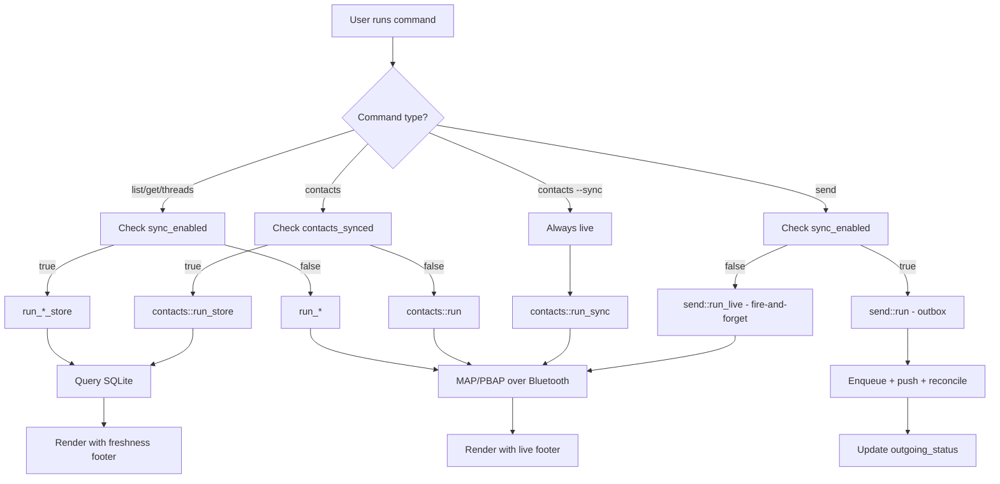

# Opt-in Dispatch Architecture

The CLI routes every read and write command between two fundamentally different execution paths: a **local store** path that reads from an encrypted on-disk database, and a **live device** path that connects directly to the phone over Bluetooth. The routing decision is not a simple boolean — it is governed by two independently-tracked sync flags that reflect the fundamentally different synchronization schedules of the Message Access Profile (MAP) and the Phone Book Access Profile (PBAP).

## The Two Sync Domains

The system maintains two separate opt-in states in the store's `meta` table:

- **`sync_enabled`**: Controls the MAP domain — message listing, retrieval, threading, and sending. This flag is set to `"true"` when `imsg sync` successfully completes a full MAP backfill.

- **`contacts_synced`**: Controls the PBAP domain — contact listing, lookup, and retrieval. This flag is set independently because PBAP synchronization happens on a different schedule than MAP. A device may have successfully synced messages but not yet completed a contacts refresh, or vice versa.

This separation was not always present. Earlier versions of the CLI used a single `sync_enabled` flag for both domains, which caused contacts to silently trust MAP's sync state. The fix (visible in the test `keys_are_tracked_independently`) ensures that contacts queries fall back to live device access when `contacts_synced` is not set, even if `sync_enabled` is true.

## Dispatch Functions

The routing lives in `crates/cli/src/commands/dispatch.rs`, which provides five public dispatch functions:

```rust
pub(in crate::commands) async fn run_list(...)
pub(in crate::commands) async fn run_contacts(...)
pub(in crate::commands) async fn run_get(...)
pub(in crate::commands) async fn run_threads(...)
pub(in crate::commands) async fn run_send(...)
```

Each function follows the same pattern: check the appropriate opt-in flag, then delegate to either the `*_store` variant or the live `run_*` variant. The `is_opted_in` helper reads the flag from the store's `meta` table, treating any error as "not opted in" so the command falls back to live device access:

```rust
async fn is_opted_in(store: &store::Store, key: &str) -> bool {
    match store.get_meta(key).await {
        Ok(v) => v.as_deref() == Some("true"),
        Err(e) => {
            tracing::warn!("failed to read {key} from store, falling back to phone: {e}");
            false
        }
    }
}
```

This defensive fallback ensures that a corrupted or unreadable store does not block the user from accessing their data on the device.

## Read Commands: Store vs. Live

For read operations (`list`, `get`, `threads`, `contacts`), the dispatch determines not just where data comes from, but also what metadata accompanies the output:

| Command | Opted-in path | Non-opted-in path |
|---------|---------------|-------------------|
| `list` | `list::run_store` — queries SQLite, shows delivery badges, freshness footer | `list::run` — MAP listing, no badges, "(live from device)" footer |
| `get` | `get::run_store` — reads body from SQLite, local mark-read, freshness footer | `get::run` — MAP body fetch, device-side mark-read, live footer |
| `threads` | `threads::run_store` — aggregated from SQLite, badges on latest message, freshness footer | `threads::run` — MAP threads, no badges, live footer |
| `contacts` | `contacts::run_store` — cached vCards, freshness footer | `contacts::run` — PBAP pull, live footer |

The freshness footer is particularly important: it tells the user how stale the data might be. The store path shows the timestamp of the last successful sync (or prompts to run `imsg sync` if never synced), while the live path explicitly marks the data as coming directly from the device.

## The Contacts Exception: `--sync`

The `contacts` command has a special case: the `--sync` flag bypasses the opt-in dispatch entirely. This is a write operation (refreshing the contacts cache), not a read, so it always runs against the live device regardless of `sync_enabled` or `contacts_synced`:

```rust
if opts.sync {
    let fut = contacts::run_sync(cfg, spoke, device, db, config_path);
    return with_spinner("syncing contacts", fut).await;
}
```

The `run_sync` function performs a full PBAP pull and renders a report. The `contacts_synced` metadata flag is set separately by the parent `sync` command via `session::contacts::sync_contacts`, which writes to the store internally. This explicit refresh is the only way to populate the contacts cache.

## Send: Two Different Semantics

The `send` command presents an interesting design choice. When opted in, it uses the full outbox lifecycle:

- Enqueue the message to the store with `outgoing_status = Queued`
- Push to the device via MAP
- Update the status based on the device's response (sending, sent, failed)

When not opted in, it uses a fire-and-forget push:

- No store write — the message is pushed directly to the device
- No delivery tracking, no retry, no status badge in subsequent `list` output
- Transient failures surface immediately to the user

This distinction matters because the opted-in path provides durable send intent: if the device is unreachable at send time, the outbox will retry on the next `imsg sync`. The non-opted-in path prioritizes simplicity and immediate feedback.

## Canonical Number Normalization

Before the dispatch fork, phone numbers are normalized once:

```rust
opts.from = opts.from.map(|f| canonical_number(&f));
```

The `canonical_number` function converts numbers to E.164 format when possible, falling back to the raw input otherwise. This normalization happens before the fork because both the store path (which matches on canonical addresses) and the live path (which sends the canonical form to the device's PBAP search) need the same canonical form. Normalizing twice would be wasteful and risks introducing inconsistencies.

## The Unsync Operation

Running `imsg unsync` clears both sync flags:

```rust
pub(crate) async fn disable(store: &Store) -> Result<()> {
    store.set_meta("sync_enabled", "false").await?;
    store.set_meta("contacts_synced", "false").await?;
    Ok(())
}
```

This reverts all read commands to live device access. The database file and all synced data are preserved — only the flags change. The `--purge` option additionally deletes the database files, removing all cached data.

## Architectural Implications

The opt-in dispatch creates a clear boundary in the codebase: each command module (`list.rs`, `get.rs`, `contacts/mod.rs`, etc.) implements both a store variant and a live variant, and the dispatcher chooses which to call. This separation has several consequences:

1. **Testability**: Each variant can be tested independently. The dispatch logic itself is tested in `dispatch/tests.rs` to verify flag handling.

2. **Extensibility**: Adding a new read command requires implementing both variants and adding a dispatch function — a small amount of boilerplate that ensures the opt-in behavior is always considered.

3. **Failure isolation**: A failed store read does not block live access. The `is_opted_in` helper treats store errors as "not opted in," falling back gracefully.

4. **Consistency**: The freshness footer and delivery badges are only available on the store path, making the difference in data source visible to the user.

## Relationship to Other Components

The dispatch layer sits between the command-line argument parsing (in `crates/cli/src/cli.rs`) and the underlying protocol implementations (MAP in `session::live`, PBAP in `session::contacts`). It does not implement any protocol logic — it merely decides which implementation to use based on sync state.

The store itself is an encrypted SQLite database opened via `store::Store::open`. The dispatch layer does not manage the store's lifecycle; that is handled by `load_with_store` in `mod.rs`, which opens the store before calling dispatch functions that need it.

The broker (used for RFCOMM transport) is invoked from the live variants when no hub endpoint is present. The dispatch layer is agnostic to the transport — whether the live path uses a direct hub connection or IPC to the broker, the dispatch decision is the same.



The diagram shows how the dispatch decision flows for each command type, and how the two paths produce different output metadata (freshness vs. live footer, delivery badges vs. none).