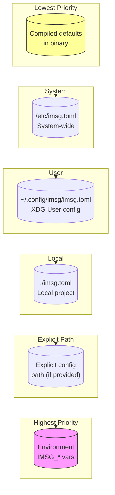

# Layered Configuration

Configuration in imsg follows a layered approach, where values are merged from multiple sources with a clear priority order. This design supports the varied deployment scenarios imsg encounters: from single-user desktop installations to shared multi-user systems, from development environments to production deployments.

## The Layer Stack

When imsg loads its configuration, it builds a merged view from six distinct sources, each potentially contributing values that override those from lower-priority layers:



The priority runs from bottom to top: compiled defaults provide the foundation, each subsequent layer can override any value, and environment variables have the final say. This mirrors how many Unix tools handle configuration—from `/etc/` system files through user home directory overrides to runtime environment tweaks.

## Why Layered Configuration?

Several design pressures shaped this approach:

**Defaults must be safe.** The compiled-in defaults in `lib.rs` define values that work out of the box without any configuration file present. Notably, `device.address` has no default—it must be provided by a higher layer or the configuration fails to load. This ensures that a fresh installation cannot accidentally connect to an arbitrary Bluetooth device.

**System administrators need control.** Placing `/etc/imsg.toml` above the user's XDG config allows system-wide policies: a system administrator can set default timing parameters, security levels, or device restrictions that users cannot accidentally override by editing their local config.

**Users have personal preferences.** The XDG-compliant user config at `~/.config/imsg/imsg.toml` is where GUI tools and CLI commands write device configuration, hub keys, and personal preferences. This layer sits above system config so individual users can customize behavior.

**Development needs override capability.** The local `./imsg.toml` layer supports development and testing workflows where a project-specific configuration should take precedence without modifying the user's personal config. This is particularly useful when running imsg from different project directories.

**Runtime flexibility through environment.** The `IMSG_` prefixed environment variables with `__` as the nesting separator (e.g., `IMSG_DEVICE__ADDRESS`, `IMSG_BROKER__SECURITY_LEVEL`) provide a way to override configuration without editing files. This is essential for containerized deployments, CI/CD pipelines, and debugging scenarios.

## How Merging Works

The implementation uses the [figment](https://docs.rs/figment) library, which handles the mechanical work of merging values from different providers while preserving type information. Each layer is added to a `Figment` instance in priority order:

```rust
pub(crate) fn figment(explicit: Option<PathBuf>) -> Figment {
    let mut f = Figment::from(Toml::string(DEFAULTS))
        .merge(Toml::file("/etc/imsg.toml"));

    if let Some(xdg) = dirs::config_dir() {
        f = f.merge(Toml::file(xdg.join("imsg/imsg.toml")));
    }

    let mut f = f.merge(Toml::file("imsg.toml"));

    if let Some(path) = explicit {
        f = f.merge(Toml::file(path));
    }

    f.merge(Env::prefixed("IMSG_").split("__"))
}
```

The key insight is that each layer is **additive and overriding**: a value present in a higher layer completely replaces the corresponding value from lower layers. There is no deep merging of nested tables—either a section is present in a layer or it isn't. This simplifies reasoning about configuration: the final value for any key comes from exactly one layer.

## Silent Skipping

A deliberate design choice is that file layers are silently skipped when absent. If `/etc/imsg.toml` doesn't exist, configuration loading continues without error. If the user hasn't created `~/.config/imsg/imsg.toml` yet, that's fine too. Only the compiled defaults are guaranteed to exist.

This behavior contrasts with a strict approach that would require each layer to exist. The rationale is practical: imsg should work immediately after installation without requiring administrative setup, and users shouldn't be confronted with errors about missing configuration files they never intended to create.

## Writes Always Target User Config

While reads consult all layers, writes have a single destination: the XDG user configuration file at `~/.config/imsg/imsg.toml`. Functions like `set_device()`, `set_channels()`, and `set_hub_key()` all write to this location, regardless of whether other layers exist.

This design has several implications:

1. **User ownership**: Configuration changes made through imsg's CLI or GUI always modify the user's personal config, not system-wide or project-local files.

2. **Atomic multi-key writes**: When setting multiple related values (like `set_device_and_channels` which writes address, map_channel, and pbap_channel together), the implementation performs a single read-modify-write cycle. This prevents a failed validation from leaving the file in a partially-updated state.

3. **Pre-write validation**: Before any I/O occurs, the new values are validated against the same rules applied at load time. This guarantees that a value written by imsg will always load successfully—there's no way to save an invalid configuration.

4. **Preservation of other keys**: The `patch_config` function reads the existing file, modifies only the specified keys, and writes back the complete document. Other configuration sections and keys remain untouched.

## Validation and Safety

Configuration validation happens at load time through the `validate()` function, which checks:

- **MAC address format**: The `device.address` must parse as a valid Bluetooth MAC address (`XX:XX:XX:XX:XX:XX`).
- **Channel bounds**: Both `map_channel` and `pbap_channel` must be in the range [1, 30].
- **Channel uniqueness**: MAP and PBAP cannot share an RFCOMM channel—the device cannot route inbound data to two profiles simultaneously.
- **Broker timing consistency**: The CLI's readiness wait time must exceed the broker's startup budget by a margin that accounts for IPC overhead.

These constraints are not merely advisory; they are enforced before configuration can be used. The design ensures that a running imsg instance never encounters an invalid configuration value that could cause runtime failures.

## Environment Variable Syntax

Environment variables provide the highest-priority override mechanism. The naming convention uses the `IMSG_` prefix followed by the configuration key path, with double underscores (`__`) as the nesting separator:

```bash
# Set device address
export IMSG_DEVICE__ADDRESS="AA:BB:CC:DD:EE:FF"

# Override MAP channel
export IMSG_DEVICE__MAP_CHANNEL=5

# Set broker security level
export IMSG_BROKER__SECURITY_LEVEL=medium

# Override database path
export IMSG_STORE__PATH="/custom/path/messages.db"
```

This syntax mirrors figment's convention and allows any configuration value to be overridden without editing files. In containerized environments where the filesystem may be read-only or ephemeral, environment variables are the only viable configuration mechanism.

## The is_device_configured Distinction

The `is_device_configured()` function provides a subtle but important capability: it checks whether `device.address` is set by any layer, without performing full validation or failing on other missing fields.

This exists because the GUI needs to distinguish between "no device has been configured yet" and "configuration failed for some other reason." The general `load()` function returns a flat error type that doesn't carry structured field information, so pattern-matching on `ConfigError` cannot make this distinction. `is_device_configured()` solves this by directly querying the figment provider without attempting full extraction.

## Related Concepts

The layered configuration system interacts with several other parts of imsg:

- **Broker lifecycle**: The `BrokerConfig` values (timing, security level) flow through the layered config and control the session broker's startup behavior. The validation ensures the CLI never gives up while the broker is still legitimately connecting.

- **Hub key management**: The hub's node key is written to the user config layer by `imsg spoke add`. It's absent from defaults and only appears after explicit configuration.

- **Path resolution**: The `StoreConfig::resolve()` method falls back to `db_path()` when no `path` is configured, providing a deterministic default location for the SQLCipher database.

- **Abstract socket names**: The broker's abstract socket name incorporates the device address, providing per-device isolation. This path is derived at runtime rather than configured, but it ensures that multiple devices can be served simultaneously without conflict.

## Design Trade-offs

The layered approach is not without costs. Users must understand which layer takes precedence when debugging configuration issues—a value that seems to be ignored may be overridden by a higher-priority layer. The silent skipping of absent files can also mask permission problems or typos in file paths.

However, the benefits outweigh these concerns for imsg's use case. The approach provides flexibility for diverse deployment scenarios, supports safe defaults, enables administrative control, and allows runtime overrides when needed. The single write destination simplifies reasoning about where configuration changes persist.

Understanding this layered model helps when troubleshooting configuration issues: check environment variables first, then the local file, then the user config, then system config, and finally the compiled defaults. The value you're seeing in the running system comes from the highest layer that provides it.