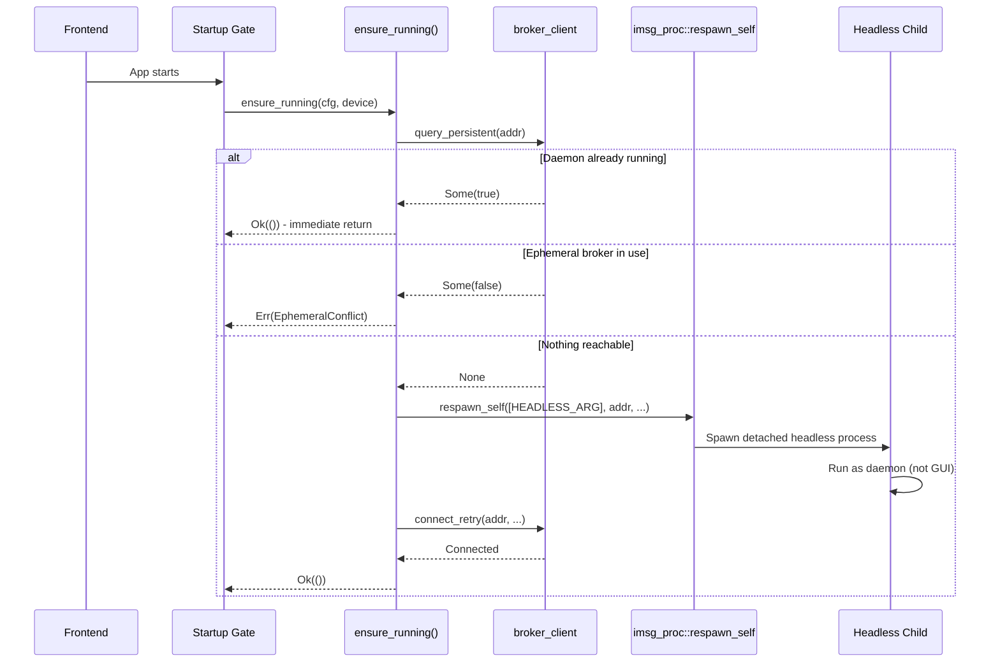

# Daemon Self-Provisioning

The imsg GUI faces a fundamental architectural constraint that the CLI does not: it cannot function without a reachable daemon. Where the CLI can simply spawn a separate `imsg` binary to become a daemon, the GUI must bring up its own backend service or fail. This page explains how the GUI solves this problem through self-provisioning — a mechanism where the GUI spawns itself as a headless daemon process when no daemon is running.

## The Provisioning Problem

Unlike command-line applications that can exit after spawning background work, the imsg GUI is a persistent GUI application that requires continuous access to the message broker's functionality. Every operation — sending messages, reading contacts, discovering devices — ultimately routes through the daemon. The GUI has no meaningful operation without it.

This creates a bootstrapping challenge: the GUI needs the daemon to be running, but there's no separate "imsg-gui-daemon" binary to launch. The CLI solves this by bundling both the client and daemon logic in a single binary, then spawning itself with different arguments. The GUI cannot follow this pattern directly because:

1. **Tauri constraints**: The GUI is built as a Tauri application, and the main process is the webview host. It cannot easily "become" a different program.

2. **Architectural separation**: The `imsg-broker` and `imsg-broker-client` crates were explicitly extracted to be CLI-agnostic. Bundling a daemon binary inside the GUI would defeat this separation.

3. **User experience**: The GUI should simply work when launched. Requiring users to manually start a daemon first would create friction.

## The Self-Respawn Solution

The GUI solves this by re-executing itself as a headless daemon. When the GUI detects that no daemon is running, it spawns a detached child process running the same executable, but with a special flag that tells the child to run the daemon in-process rather than open a GUI window.

This approach has several advantages:

- **Single binary**: No separate daemon binary is needed.
- **Shared state**: The daemon runs with the same configuration and environment as the GUI that spawned it.
- **Familiar primitive**: It uses the same `imsg_proc::respawn_self` function that the CLI uses for background daemon spawning, ensuring consistency across the codebase.

## Launch Classification

At startup, the GUI must determine whether it was launched normally (to display a window) or as a self-provisioned headless daemon. This is determined by examining the process arguments:

```rust
pub const HEADLESS_ARG: &str = "--__daemon_foreground";

pub fn classify_launch(args: &[String]) -> Result<Launch, HeadlessArgsError> {
    if !args.iter().any(|a| a == HEADLESS_ARG) {
        return Ok(Launch::Gui);
    }
    let device = flag_value(args, "--device").ok_or(HeadlessArgsError::MissingDevice)?;
    let config_path = flag_value(args, "--config").map(PathBuf::from);
    Ok(Launch::Headless(HeadlessArgs { device, config_path }))
}
```

The `HEADLESS_ARG` flag (`--__daemon_foreground`) is an internal marker — never user-facing — that indicates this process should run the daemon instead of the GUI. When present, the arguments also include `--device` (the Bluetooth address) and optionally `--config` (the configuration file path).

In `main.rs`, this classification determines the entire startup path:

```rust
fn main() -> anyhow::Result<()> {
    let args: Vec<String> = std::env::args().collect();
    match provision::classify_launch(&args)? {
        Launch::Headless(headless) => tauri::async_runtime::block_on(headless_main(headless)),
        Launch::Gui => gui_main(),
    }
}
```

## Provision State Classification

Before spawning a daemon, the GUI must determine whether one is already running. This is not simply a matter of "is something listening," because the system may have an ephemeral one-shot broker running (used for CLI operations like `imsg send`). The GUI must distinguish between three states:

```rust
pub enum ProvisionState {
    /// A persistent daemon already answers at the target address — nothing to spawn.
    AlreadyRunning,
    /// Something is listening, but as the ephemeral one-shot broker, not a daemon — refuses to
    /// spawn onto the same socket while it's in use rather than race it.
    EphemeralConflict,
    /// Nothing reachable — safe to spawn.
    Unreachable,
}
```

The classification is based on the result of querying the broker's persistent status:

```rust
pub const fn classify(persistent: Option<bool>) -> ProvisionState {
    match persistent {
        Some(true) => ProvisionState::AlreadyRunning,
        Some(false) => ProvisionState::EphemeralConflict,
        None => ProvisionState::Unreachable,
    }
}
```

This pure, deterministic function is kept separate from the reachability check itself, making it testable without requiring a live socket.

## The Provisioning Flow

The provisioning process follows this sequence:



The `ensure_running` function is idempotent — if a daemon is already running, it returns immediately. If an ephemeral broker is using the socket, it returns an error rather than racing with it. Only if nothing is reachable does it spawn a new daemon.

## Headless Daemon Execution

When the GUI spawns itself in headless mode, the child process takes a different code path. Instead of initializing Tauri and opening a window, it:

1. Loads the configuration
2. Opens the local store
3. Records that daemon mode is enabled
4. Runs the broker daemon in-process

```rust
pub async fn run_headless(
    cfg: Config,
    device: Option<String>,
    store: Store,
) -> Result<(), ProvisionError> {
    store.set_meta("daemon_enabled", "true").await?;
    let addr = device.clone().unwrap_or_else(|| cfg.device.address().to_owned());
    tauri::async_runtime::spawn(announce_when_connected(addr));
    imsg_broker::run_daemon(cfg, device, store).await?;
    Ok(())
}
```

The `announce_when_connected` function polls the daemon's IPC socket until the MAP session reports `Active`, then logs a confirmation message. This mirrors the CLI daemon's behavior and provides feedback in the captured log.

## Integration with the Startup Gate

The provisioning mechanism is invoked from the startup gate, which orchestrates the GUI's initialization sequence:

```rust
async fn run<F, R>(state: &GateState, config_path: Option<PathBuf>, ...) {
    loop {
        let Ok(cfg) = config::load(config_path.clone()) else {
            state.park(GateStatus::AwaitingDeviceConfig).await;
            continue;
        };
        state.set(GateStatus::StartingDaemon);
        if let Err(e) = crate::daemon::provision::ensure_running(&cfg, None, config_path.clone()).await {
            state.park(failed(GateStage::Daemon, &e)).await;
            continue;
        }
        // ... continue with store opening and sync
    }
}
```

The gate handles all failure modes gracefully. If provisioning fails, it parks at a `Failed` status and re-runs from the top when the user triggers a retry via `GateState::proceed`.

## Why This Design

The self-provisioning approach reflects several architectural decisions:

1. **Single executable**: Users should only need to install one application. The GUI bundles everything it needs.

2. **Shared infrastructure**: By using `imsg_proc::respawn_self`, the GUI leverages the same spawn/detach primitive that the CLI uses. This reduces code duplication and ensures consistent behavior.

3. **Graceful degradation**: The system handles all three provision states appropriately — using an existing daemon, refusing to conflict with an ephemeral broker, or spawning a new daemon.

4. **Testability**: The pure `classify` function and the `classify_launch` function can be tested without sockets or actual processes. The integration points use real sockets but are isolated in the test suite.

This design enables the GUI to provide a seamless user experience: launch the app, and everything just works, with the daemon automatically materializing in the background when needed.