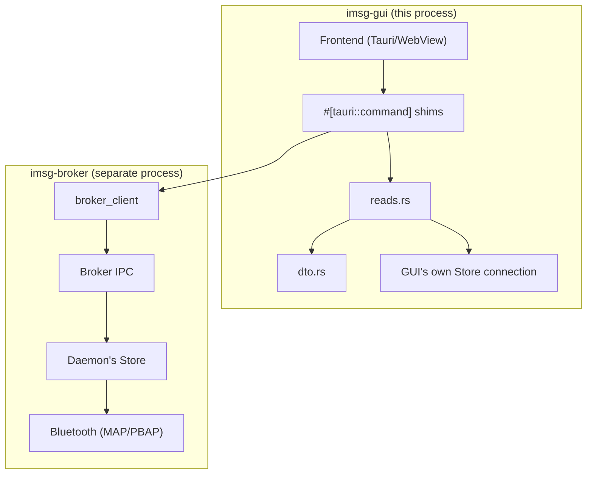
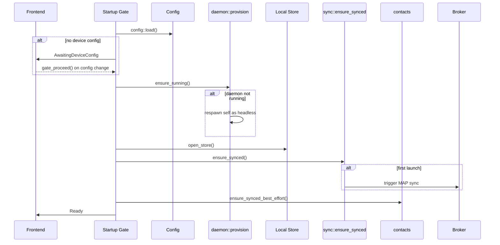

# Data Flow & DTOs

Understanding how data moves through the imsg GUI requires grasping a fundamental architectural decision: the **dual-store pattern**. The GUI maintains its own independent connection to the local SQLite store while also communicating with a separate daemon process that holds the live Bluetooth session. This separation enables the GUI to remain responsive during Bluetooth operations while ensuring data consistency through a well-defined boundary.

## The Dual-Store Architecture

The imsg GUI operates with two distinct data sources that serve different purposes:



The **local store** (`reads.rs`) opens its own `Store` connection directly to the SQLite database, identical to what the CLI's `list`/`get`/`threads` commands do. This connection never leaves the GUI process and provides the data for all read operations—message lists, thread summaries, and cached contacts. The GUI can query this store freely without waiting for Bluetooth or network I/O.

The **broker-mediated path** handles operations that require the live Bluetooth session: sending messages, deleting messages, and triggering synchronizations. These operations forward requests to the daemon process via `imsg-broker-client`, which holds the exclusive MAP session. The daemon's own store receives the results, and the GUI's next poll of its local store picks up the changes.

This separation has important implications for consistency. When a user sends a message, the GUI forwards the request to the broker, which creates an outbox entry in the daemon's store. The GUI's local store only sees this entry after the next sync operation pulls it in. There's an inherent delay between "send succeeded" and "the message appears in the local message list"—this is by design, not a bug.

## Why DTOs? The Decoupling Rationale

The GUI defines its own data transfer objects in `dto.rs` and `dto/contacts.rs` rather than using the store's internal row types directly. This isn't mere redundancy—it reflects a deliberate decoupling strategy with several motivations.

The store's row types (`MessageRow`, `ThreadRow`, `ContactRow`) are implementation details of `imsg-store`. They include SQLite-specific fields like `rowid`, raw status integers, and internal identifiers that mean nothing to a frontend. More critically, these internal shapes can change as the store evolves—adding a new column, refactoring a field, or switching to a different storage backend. If the frontend bound directly to these types, every such change would force a corresponding update in the TypeScript bindings and potentially break the deployed application.

The DTOs in `imsg-gui` present a stable, frontend-oriented contract. Consider `MessageDto`:

```rust
pub struct MessageDto {
    pub handle: String,
    pub timestamp_ms: i64,
    pub folder: String,
    pub direction: Direction,
    pub address: String,
    pub read: bool,
    pub text: String,
    pub outgoing_status: Option<OutgoingStatus>,
}
```

The `read` field is a boolean derived from the store's raw status integer—the DTO presents the semantic meaning rather than the storage mechanism. The `direction` and `outgoing_status` enums mirror the store's own types but live in the GUI's namespace, ensuring that a frontend concern (how to render these states) never forces a change on the store's wire format.

The same pattern appears in `dto/contacts.rs` for contact data and in `dto.rs` for configuration and device discovery. Each transformation from store row to DTO is a one-way conversion implemented via `From` traits:

```rust
impl From<&store::MessageRow> for MessageDto {
    fn from(row: &store::MessageRow) -> Self {
        Self {
            handle: row.map_handle.clone(),
            timestamp_ms: row.timestamp_ms,
            // ... derived fields like `read` and `direction`
        }
    }
}
```

This conversion is explicit and visible. There's no hidden serialization magic—the frontend contract is exactly what the DTO defines.

## The Startup Gate: Orchestrating Readiness

The startup gate in `gate.rs` manages the sequence from cold start to a usable application. It's a single Rust-owned loop that runs once at launch, bringing up the daemon, opening the local store, and performing initial synchronization:



The gate's state is the single source of truth for startup progress. The frontend polls `gate_status()` to know what to render—a loading spinner during daemon startup, a device-config form if no device is configured, or the main UI once `Ready`. Every step is idempotent: if `gate_proceed()` is called multiple times, the loop simply re-derives everything from ground truth.

Critically, the gate runs **before** the frontend can issue any commands. By the time the application is usable, the local store is open, the daemon is reachable, and at least one sync has completed. This ensures that every subsequent command operates on a consistent foundation.

## Local vs. Broker-Mediated Operations

Understanding which operations touch which data source is essential for reasoning about behavior:

**Local-only operations** (read from GUI's store):
- Listing messages (`list_messages`, `get_by_handle`)
- Listing threads (`threads`)
- Listing contacts (`list_contacts`, `get_contact`, `lookup_contact`)
- Marking messages read locally (`mark_read`)
- Reading configuration (`config::show`)

**Broker-mediated operations** (forwarded to daemon):
- Sending messages (`send`)
- Deleting messages (`delete`)
- Triggering MAP sync (`sync::ensure_synced`)
- Triggering PBAP contact sync (`contacts::sync_now`)
- Daemon lifecycle (`daemon::install`, `daemon::stop`, etc.)

The `mark_read` operation illustrates the boundary clearly. When the frontend marks a message as read, the GUI updates its local store immediately:

```rust
pub async fn mark_read(db: &store::Store, handle: &str) -> Result<(), store::Error> {
    db.update_status(handle, store::STATUS_READ).await
}
```

However, this is purely a local change. The device-side mark-read is deferred to the next sync—the GUI doesn't open a Bluetooth connection for this operation. The daemon's next reconciliation with the device will pick up the local change and push it to the device.

## The Read Path in Detail

When the frontend requests a message list, the flow is straightforward:

1. The frontend calls the Tauri command `list_messages`
2. The command shim in `commands/reads.rs` extracts the managed `Store` from Tauri state
3. It delegates to `reads::list_messages`, which queries the GUI's local store
4. Each `MessageRow` is converted to a `MessageDto` via the `From` implementation
5. The DTOs are returned to the frontend through Tauri's IPC

This path involves no network I/O, no Bluetooth, and no broker communication. It's bounded entirely by SQLite query performance. The frontend can poll this endpoint freely without affecting the daemon or the device.

The contact read path follows the same pattern, using `dto/contacts.rs` types. The GUI's local store holds cached contacts from previous PBAP syncs; the DTOs present these in a frontend-friendly shape.

## The Write Path in Detail

When the frontend sends a message, the flow crosses the broker boundary:

1. The frontend calls `send` with the recipient number and message text
2. The command shim delegates to `send::send` in `send.rs`
3. `send::send` calls `broker_client::send`, which connects to the daemon's IPC socket
4. The daemon creates an outbox entry in its own store and initiates the MAP push
5. On success, the daemon returns a confirmation; on failure, an error propagates back

The GUI's local store is not involved in the outbox. The message only appears in the GUI's message list after the daemon completes the push and the next sync pulls the sent message back into the shared store. This eventual consistency is a direct consequence of the dual-store architecture.

Delete operations follow the same broker-mediated pattern, as do contact sync requests. Each crosses the process boundary and waits for the daemon's response.

## Configuration and Discovery

Configuration operations are local-only—they read from and write to the config file without involving the broker or Bluetooth. The `config.rs` module wraps `imsg-config` calls and transforms the result into `ConfigDto`:

```rust
pub fn show(explicit: Option<PathBuf>) -> Result<ConfigDto, config::ConfigError> {
    Ok(ConfigDto::from(&config::load(explicit)?))
}
```

Device discovery (`discover.rs`) queries the local Bluetooth adapter via `imsg-transport::discover` and transforms the results into `PairedDeviceDto` and `ChannelsDto`. These are GUI-specific types that mirror the transport crate's types but present a stable frontend contract.

## Implications for Frontend Development

The dual-store pattern has practical consequences for frontend developers:

- **Polling is necessary** for seeing new data. The GUI doesn't receive push notifications from the daemon—message lists and contact lists must be refreshed to see changes made by the daemon (incoming messages, sent messages, synced contacts).

- **Send/delete operations are asynchronous** relative to the local store. A successful send returns immediately, but the message may not appear in the list until the next sync completes.

- **The startup gate controls availability**. The frontend can't issue most commands until the gate reaches `Ready`. The `gate_status` command tells the frontend where in the startup sequence the application is.

- **DTO stability is guaranteed**. The types in `dto.rs` are the stable contract—internal store changes won't break the frontend without a corresponding DTO change.

## Related Concepts

- The [Startup Gate](startup-gate.md) page covers the gate's state machine and error handling in detail.
- The [Broker IPC](../ipc/ipc-protocol.md) page explains the wire protocol between the GUI and daemon.
- The [Store Architecture](../storage/message-storage.md) page covers the local store's design and row types.