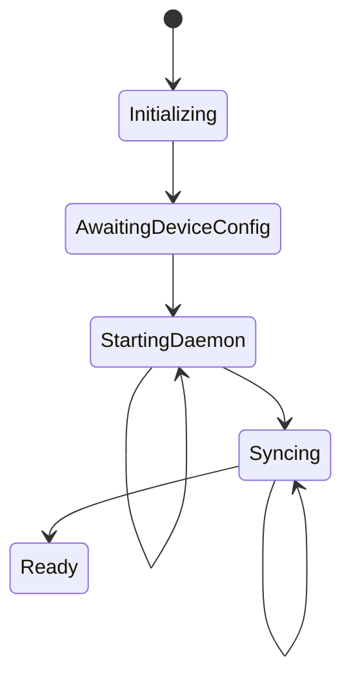

# Startup Gate

The startup gate is the initialization state machine that orchestrates the GUI application's journey from a cold start to a fully operational state. It is the single authoritative source that determines whether the application is ready for use, and it manages the complex dependencies between configuration, daemon availability, local storage, and data synchronization.

## Why a Centralized Startup Sequence?

The GUI application faces a fundamental coordination problem that the CLI does not: it must bring up multiple interdependent systems in a specific order before the user can interact with the application. The CLI operates on demand—each command independently brings up what it needs. The GUI, by contrast, must present a consistent, ready state from the moment its window appears.

This creates a chain of dependencies. The application needs a device address before it can connect to a daemon. It needs a daemon before it can open the local store, because the store's encryption key may be guarded by the OS keyring, and the keyring service might be unavailable if no desktop session is active. It needs the store before it can synchronize messages, because synchronization state is persisted locally. And it needs message synchronization before it can display meaningful content.

The startup gate exists to manage this chain as a single, coherent process rather than a collection of ad-hoc checks scattered throughout the UI layer.

## The Gate's Architecture

The gate is implemented as a single Rust-owned async loop, spawned once during application initialization by `main.rs`. This loop runs independently of the Tauri frontend and owns the entire startup sequence from start to finish.



The loop publishes its current status through a `watch::Sender<GateStatus>`, which the Tauri frontend polls to determine what UI to display. When the loop encounters a condition that requires external action—such as missing device configuration—it parks itself and waits until the frontend signals that conditions may have changed.

## The Startup Sequence

The gate executes five distinct steps in order:

1. **Configuration loading** — The gate attempts to load the resolved configuration from all sources (defaults, environment variables, config files). If no device address is present, the gate parks at `AwaitingDeviceConfig`.

2. **Daemon provisioning** — The gate ensures a daemon process is reachable at the configured device address. If no daemon is running, the GUI self-provisions one by re-executing itself in headless mode, running the broker in-process. This is a critical design decision: the GUI cannot shell out to a separate binary (that would defeat the purpose of extracting `imsg-broker` as CLI-agnostic), so it re-execs itself using the same `imsg_proc::respawn_self` primitive the CLI uses.

3. **Store opening** — The gate opens the local SQLite store, which holds cached messages, contacts, and synchronization state. The store opener is injected rather than called directly, allowing tests to substitute a fixed-key store without touching the OS keyring.

4. **Message synchronization** — The gate ensures the store has completed at least one MAP sync with the device. This is idempotent: if the `sync_enabled` metadata flag is already set, the gate returns immediately. Otherwise, it triggers a sync via the broker and marks the flag on success.

5. **Contacts synchronization** — The gate triggers a PBAP contacts pull. Unlike message sync, this runs on every launch rather than once-ever, because PBAP has no push channel—manual refresh is the only way contacts update. Failure is logged and swallowed rather than propagated, because contacts are supplementary display data, not required for the app to be usable.

## The Park-and-Wake Pattern

The gate uses a park-and-wake pattern to coordinate with the frontend without tight coupling. When the gate needs the frontend to do something—provide device configuration, or retry after a failure—it publishes a status and waits for a notification.

```rust
async fn park(&self, status: GateStatus) {
    self.set(status);
    self.proceed.notified().await;
}
```

The `proceed` notification carries no information about *what* changed. This is intentional. The gate re-derives everything from ground truth on every pass: it re-loads the config, re-checks daemon availability, and re-evaluates the sync state. A stray or repeated poke is harmless because the gate will simply re-verify everything and land in the same state.

This design has important consequences for robustness. If the user provides device configuration while the gate is still initializing, the poke will simply wake the loop, which will then load the now-valid config and proceed. If the user taps "Retry" on a failure screen, the poke wakes the loop, which retries from the top. There is no complex state reconciliation because the gate never trusts cached state—it always asks the system.

## Failure Handling

The gate treats failures as recoverable by default. When any step fails, the gate parks at a `Failed` status with the stage that failed and an error message. The frontend displays this to the user and offers a retry action. When the user triggers retry, the gate re-runs from the top.

Critically, the gate preserves the already-opened store across retries. If the daemon was successfully started but sync failed, re-running from the top would normally require re-opening the store. The gate avoids this by holding the store in an `Option` and reusing it on subsequent passes:

```rust
let db = match store.take() {
    Some(db) => db,
    None => open_store(&cfg).await?,
};
```

This means a sync failure triggers a quick retry without the overhead of re-provisioning the daemon or re-opening the database.

## The Frontend Surface

The frontend's interface to the gate is deliberately narrow. There are exactly two commands:

- `gate_status()` — Returns the current `GateStatus`. The frontend polls this to decide what screen to show: a loading indicator, a device-config prompt, a failure message with retry, or the main application.

- `gate_proceed()` — Wakes a parked gate. Called after the user saves device configuration, or when the user taps "Retry" on a failure screen.

This narrow surface is a design principle: the frontend should not need to understand the startup sequence. It simply reflects the gate's current state, and notifies the gate when the user has acted. All sequencing logic lives in the gate loop, not in the UI layer.

## Idempotency and Ground Truth

Every step in the gate is idempotent. Loading configuration always produces the current config or fails. Checking daemon availability always queries the current system state. Checking sync status always reads the current metadata flag. Triggering a sync is idempotent because the broker handles the actual synchronization logic.

This idempotency is what makes the park-and-wake pattern safe. The gate does not need to know *what* changed when it wakes—it simply re-asks the system. This eliminates an entire class of bugs where stale UI state causes the application to behave incorrectly.

## Relationship to Other Components

The startup gate sits at the intersection of several major components:

- **Configuration** — The gate depends on `config::load` to provide device address and other settings. The frontend modifies configuration through thin config commands, and the gate re-loads on every pass.

- **Daemon provisioning** — The gate calls `daemon::provision::ensure_running`, which handles the self-provisioning logic. This module decides whether to spawn a new daemon or reuse an existing one.

- **Store** — The gate opens the local store, which is also used by the reads module for message and contact queries. The store is handed to Tauri's state management on success.

- **Synchronization** — The gate calls `sync::ensure_synced` for message sync and `contacts::ensure_synced_best_effort` for contacts. Both communicate with the broker over IPC.

- **Frontend commands** — The gate's status is exposed through `commands::gate`, which provides the Tauri command surface. The frontend never directly calls daemon provisioning, store opening, or sync—it only polls the gate and pokes it to retry.

## Design Rationale

The gate's design reflects several specific constraints and choices:

**Self-provisioning over external spawning.** The GUI cannot spawn a separate `imsg` binary because the broker was extracted precisely to be CLI-agnostic. Self-provisioning via re-exec keeps the GUI and daemon on the same version and avoids bundling a second binary.

**Injected store opener.** The real store opener goes through the OS keyring, which can prompt the user or hang if the desktop session is locked. Tests substitute a fixed-key opener to stay hermetic.

**Best-effort contacts sync.** Contacts are important but not blocking. A failed contacts sync should not prevent the user from reading messages. The gate logs the failure and continues, knowing the next launch will retry.

**Store reuse across retries.** Holding the open store avoids redundant keyring and database operations during retry, making failure recovery fast.

**No cached state.** The gate re-derives everything from ground truth on every pass. This trades some efficiency for simplicity and robustness—the system is always consistent with the actual state of its dependencies.

## Related Documentation

- [Daemon Provisioning](daemon-self-provisioning.md) — Detailed coverage of self-provisioning and the headless re-exec mechanism
- [Configuration](../configuration/index.md) — How the layered config system works and what options the gate uses
- [Synchronization](../storage/sync-cursors.md) — The MAP sync protocol and the `sync_enabled` flag
- [Store](../storage/index.md) — The local SQLite store and its relationship to the broker's store