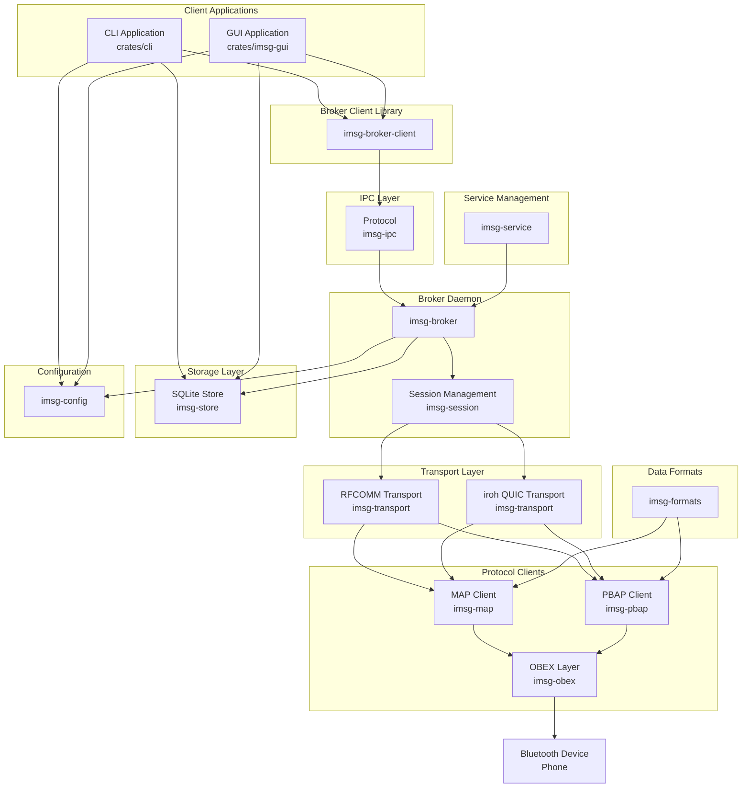

# imsg Repository Overview

## Purpose

The **imsg** repository is a Rust-based messaging system that enables communication with Bluetooth devices (primarily mobile phones) over the MAP (Message Access Profile) and PBAP (Phone Book Access Profile) protocols. It provides both a command-line interface and a graphical user application for managing SMS messages and contacts stored on Bluetooth-paired devices.

The system supports two primary modes of operation:
- **Ephemeral mode**: Commands connect directly to a device, perform an operation, and disconnect
- **Persistent (daemon) mode**: A long-running broker daemon maintains device connections for continuous synchronization

## End-to-End Architecture

The imsg system follows a layered architecture with multiple components working together to provide seamless Bluetooth messaging capabilities:

### Data Flow Summary

1. **User Interaction**: Users interact through the CLI or GUI applications
2. **Broker Communication**: Commands are sent to the Broker Daemon via the Broker Client library
3. **IPC Protocol**: Messages are serialized using the IPC protocol layer
4. **Session Management**: The broker manages device sessions, handling connection lifecycle and retry logic
5. **Transport Selection**: The system chooses between RFCOMM (Bluetooth Classic) or iroh QUIC (remote) transport
6. **Protocol Execution**: MAP/PBAP clients execute operations over OBEX
7. **Local Storage**: Messages and contacts can be cached locally in the SQLCipher store for offline access

## Core Modules Documentation

| Module | Purpose | Documentation |
|--------|---------|---------------|
| **CLI Application** | Command-line interface for all imsg operations | [CLI Application](cli-application/index.md) |
| **GUI Application** | Tauri-based graphical interface | [GUI Application](gui-application/index.md) |
| **Broker Daemon** | Long-running service mediating device communication | [Broker Daemon](broker-daemon/index.md) |
| **Session Management** | Bluetooth session establishment and lifecycle | [Session Management](session-management/index.md) |
| **Storage** | Local SQLite/SQLCipher data persistence | [Storage](storage/index.md) |
| **Transport** | RFCOMM and iroh QUIC transport implementations | [Transport](transport/index.md) |
| **Protocol Clients** | MAP and PBAP client implementations | [Protocol Clients](protocol-clients/index.md) |
| **IPC** | Inter-process communication protocol and types | [IPC](ipc/index.md) |
| **Configuration** | Multi-layered configuration management | [Configuration](configuration/index.md) |
| **Data Formats** | bMessage encoding, phone number normalization | [Data Formats](data-formats/index.md) |
| **Service Management** | OS service (systemd/launchd) integration | [Service_Management](service-management/index.md) |
| **Broker Client** | Client library for broker communication | [Broker_Client](broker-client/index.md) |
| **Process Utilities** | Self-respawn and process management utilities | [Process_Utilities](process-utilities/index.md) |

## Key Features

- **Dual Interface**: Both CLI and GUI applications for different use cases
- **Persistent Sync**: Daemon mode enables continuous message and contact synchronization
- **Offline Support**: Local storage caches messages and contacts for offline access
- **Multi-transport**: Supports both Bluetooth Classic (RFCOMM) and remote (iroh QUIC) transports
- **Service Integration**: Can run as a system service for automatic startup
- **Encrypted Storage**: SQLCipher provides encrypted local database storage