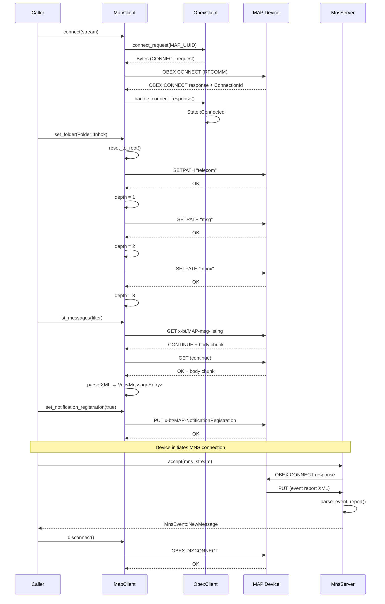

# Using the MAP Client

This page traces the end-to-end flow of connecting to a Bluetooth MAP (Message Access Profile) device, navigating the folder hierarchy, listing messages, and receiving real-time notifications through the MNS (Message Notification Service). The flow follows how a concrete operation moves through the system, enabling developers to understand the participating components, ordering, state transitions, data movement, and boundaries involved.

## Operation Overview

The primary flow traced here covers:

1. **Connection establishment** — establishing an OBEX session over RFCOMM with the MAP service
2. **Folder navigation** — navigating the MAP folder hierarchy (telecom/msg/inbox, etc.)
3. **Message listing** — retrieving the list of messages in a folder
4. **Notification registration** — enabling MNS to receive push events from the device
5. **MNS event reception** — processing incoming MAP event reports

## Starting Conditions

The flow begins with an established Bluetooth RFCOMM connection to the MAP service channel on the remote device. The caller provides a `tokio::io::AsyncRead + AsyncWrite` stream (typically an RFCOMM socket) to initiate the MAP session.

## Component Architecture

The MAP client system comprises several layers:

- **MapClient** — the main entry point, owns the OBEX state machine and transport
- **ObexClient** (in `imsg-obex`) — sans-IO OBEX protocol state machine
- **ObexTransport** — framed I/O wrapper using `ObexCodec` for length-prefix framing
- **MnsServer** — receives event reports pushed from the device
- **Folder/Navigation** — SETPATH sequencing for MAP folder hierarchy
- **Message operations** — GET/PUT operations for message listing, retrieval, and push

## Flow Phases

### Phase 1: OBEX Session Establishment

The flow begins when the caller invokes `MapClient::connect(stream)`, passing the RFCOMM stream. This initiates the OBEX CONNECT handshake with the MAP service UUID.

```rust
// crates/imsg-map/src/client/mod.rs, lines 42-50
pub async fn connect(stream: T) -> Result<Self, MapError> {
    let mut transport = wrap(stream);
    let mut obex = ObexClient::new();
    let req = ObexClient::connect_request(&MAP_UUID, None)?;
    transport.send(req).await?;
    let rsp = Self::recv(&mut transport).await?;
    obex.handle_connect_response(&rsp)?;
    Ok(Self { obex, transport, depth: 0 })
}
```

**What initiates this phase:** The caller provides a connected RFCOMM stream and calls `MapClient::connect`.

**Component ownership:** `MapClient` owns the transport and OBEX state machine. The `ObexClient` encodes the CONNECT request with the MAP UUID (`bb582b40-420c-11db-b0de-0800200c9a66`) as the Target header.

**Data crossing the boundary:** The CONNECT request carries the 16-byte MAP service UUID in the Target header. The response must include a ConnectionId header, which the OBEX client extracts and stores in its connected state.

**State transition:** The `ObexClient` transitions from `State::Disconnected` to `State::Connected { conn_id, max_packet }`. The `MapClient` initializes its `depth` counter to 0 (root level).

**Failure conditions:**
- `ObexError::ConnectRejected` — the device rejects the connection
- `ObexError::MissingConnectionId` — response lacks required ConnectionId
- `TransportError` — underlying RFCOMM I/O failure

### Phase 2: Folder Navigation

Once connected, the client must navigate to the desired message folder. The MAP specification defines a hierarchical folder structure: `telecom/msg/<folder>`. The client uses OBEX SETPATH operations to traverse this hierarchy.

The `MapClient::set_folder` method handles the complete navigation sequence:

```rust
// crates/imsg-map/src/client/nav.rs, lines 70-76
pub async fn set_folder(&mut self, folder: Folder) -> Result<(), MapError> {
    self.reset_to_root().await?;
    for segment in ["telecom", "msg", folder.as_str()] {
        self.setpath(segment).await?;
    }
    Ok(())
}
```

**What initiates this phase:** The caller invokes `set_folder(Folder::Inbox)`, `set_folder(Folder::Sent)`, or similar.

**Component ownership:** The `MapClient` owns the navigation logic. Each SETPATH request is encoded by `ObexClient::setpath_request` or `ObexClient::setpath_backup_request`.

**Data crossing the boundary:** Each SETPATH request carries the folder segment name in the Name header. The backup operation (going up one level) uses an empty Name with the backup flag set.

**State transition:** The `depth` counter increments on forward navigation (`setpath`) and decrements on backup (`setpath_up`). The client tracks its position in the folder hierarchy.

**Failure conditions:**
- `MapError::ServerError` — the device returns a non-OK response to SETPATH
- `MapError::Transport` — RFCOMM connection fails mid-navigation

**Important constraint:** iOS devices require one SETPATH per folder level. A slash-joined path like "telecom/msg/inbox" is rejected. The client must issue separate SETPATH operations for each segment.

### Phase 3: Message Listing

With the client positioned in a message folder, the caller can retrieve the list of messages using `list_messages`:

```rust
// crates/imsg-map/src/client/messages.rs, lines 31-43
pub async fn list_messages(
    &mut self,
    filter: &ListMessagesFilter,
) -> Result<Vec<MessageEntry>, MapError> {
    let req = self.obex.get_request(
        b"x-bt/MAP-msg-listing\x00",
        None,
        Some(filter.to_app_params()?),
    )?;
    self.transport.send(req).await?;
    let body = self.collect_body().await?;
    Ok(crate::xml::parse_message_listing(&body)?)
}
```

**What initiates this phase:** The caller provides a `ListMessagesFilter` and calls `list_messages`.

**Component ownership:** `MapClient` sends the GET request. The response body is accumulated through the `collect_body` method, which handles multi-packet OBEX responses (CONTINUE opcodes).

**Data crossing the boundary:** The GET request includes:
- Type header: `x-bt/MAP-msg-listing`
- AppParams: encoded filter parameters (max count, offset, read status, etc.)

The response is an XML document parsed by `parse_message_listing` into `MessageEntry` structs.

**State transition:** No OBEX state change; the client remains in the current folder.

**Failure conditions:**
- `MapError::ServerError` — device returns non-OK response
- `MapError::MessageListing` — XML parsing failure
- `MapError::ResponseTooLarge` — body exceeds 4 MiB
- `MapError::InvalidEncoding` — response is not valid UTF-8

### Phase 4: Notification Registration (MNS)

To receive real-time notifications (new messages, delivery status, etc.), the client must register with the MNS (Message Notification Service). This is a separate OBEX connection that the device initiates to push events to the client.

First, the MAP client enables notifications:

```rust
// crates/imsg-map/src/client/control.rs, lines 35-50
pub async fn set_notification_registration(&mut self, enable: bool) -> Result<(), MapError> {
    let req = self.obex.put_final_request(
        b"x-bt/MAP-NotificationRegistration\x00",
        vec![
            Header::AppParams(set_notification_registration_params(enable)),
            Header::EndOfBody(Bytes::new()),
        ],
    )?;
    self.transport.send(req).await?;
    // ... response handling
}
```

**What initiates this phase:** The caller invokes `set_notification_registration(true)` on the MAP session.

**Component ownership:** The `MapClient` sends the registration request. The device will then connect back to the client on a separate MNS RFCOMM channel.

**Data crossing the boundary:** The PUT request includes AppParams with:
- `NotificationStatus` (tag 0x0E): 0x01 to enable, 0x00 to disable
- `MasInstanceId` (tag 0x0F): the MAS instance to register

**Important constraint:** The caller must keep the MAP session alive while notifications are active. The MNS connection is a separate OBEX session that the device initiates.

### Phase 5: MNS Event Reception

The client must accept an incoming MNS connection and process event reports. This is handled by `MnsServer`:

```rust
// crates/imsg-map/src/mns_server.rs, lines 32-42
pub async fn accept(stream: T) -> Result<Self, MnsError> {
    let mut transport = wrap(stream);
    let mut server = ObexServer::new();
    let req = Self::recv(&mut transport).await?;
    let (packet, rsp) = server.handle_connect(&req, &MNS_TARGET)?;
    // ... validate Target UUID
    transport.send(rsp).await?;
    Ok(Self { transport })
}
```

Once accepted, the server yields events:

```rust
// crates/imsg-map/src/mns_server.rs, lines 80-85
pub async fn next_event(&mut self) -> Result<Option<MnsEvent>, MnsError> {
    match self.next_event_raw().await? {
        Some(body) => Ok(Some(parse_event_report(&body)?)),
        None => Ok(None),
    }
}
```

**What initiates this phase:** The device initiates an OBEX connection to the MNS channel. The client accepts this connection via `MnsServer::accept`.

**Component ownership:** `MnsServer` owns the OBEX server state machine and transport. The server validates the Target UUID against the MNS service UUID (`bb582b41-420c-11db-b0de-0800200c9a66`).

**Data crossing the boundary:** The device pushes event reports as OBEX PUT requests. Each PUT body contains an XML `<MAP-event-report>` document with event details.

**State transition:** The server transitions from initial handshake to event reception mode. Returns `None` when the device sends a clean DISCONNECT.

**Event types** (from `mns_event.rs`):
- `NewMessage` — new message arrived in a folder
- `DeliverySuccess` / `SendingSuccess` — outbound message delivered
- `DeliveryFailure` / `SendingFailure` — outbound message failed
- `MessageDeleted` — message removed from store
- `MessageShift` — message moved between folders
- `MemoryFull` / `MemoryAvailable` — device storage status
- `ReadStatusChanged` — read/unread flag toggled

**Failure conditions:**
- `MnsError::InvalidTarget` — CONNECT request Target doesn't match MNS UUID
- `MnsError::UnexpectedOpcode` — device sent non-PUT/DISCONNECT opcode
- `MnsError::Parse` — XML parsing failure
- `MnsError::Transport` — I/O failure

## Sequence Diagram



## Data Flow Summary

| Phase | Request Type | Key Headers | Response |
|-------|-------------|-------------|----------|
| Connect | OBEX CONNECT | Target: MAP UUID | ConnectionId |
| SETPATH | OBEX SETPATH | Name: folder segment | OK |
| List Messages | OBEX GET | Type: x-bt/MAP-msg-listing, AppParams | XML body |
| Notification Reg | OBEX PUT | Type: x-bt/MAP-NotificationRegistration | OK |
| MNS Events | OBEX PUT | Body: MAP-event-report XML | OK |

## Terminal State

After a successful flow:

1. **MapClient** holds a connected OBEX session with a valid ConnectionId, positioned in the requested folder (e.g., inbox), with notifications enabled
2. **ObexClient** is in `State::Connected` with the device-assigned connection ID
3. **MnsServer** (if events are being received) holds an active connection ready to yield `MnsEvent` structs
4. The caller has a list of `MessageEntry` structs containing handles, subjects, timestamps, sender info, and read status

The connection remains alive until the caller invokes `disconnect()` on the `MapClient`, which sends an OBEX DISCONNECT and consumes the session.

## Related Documentation

- [OBEX Transport](obex-transport.md) — framing codec and transport details
- [PBAP Client](obex-client-reference.md) — similar pattern for Phone Book Access Profile
- [Message Storage](../storage/message-storage.md) — how messages are persisted locally
- [Session Architecture](../session-management/session-architecture.md) — broader session management context