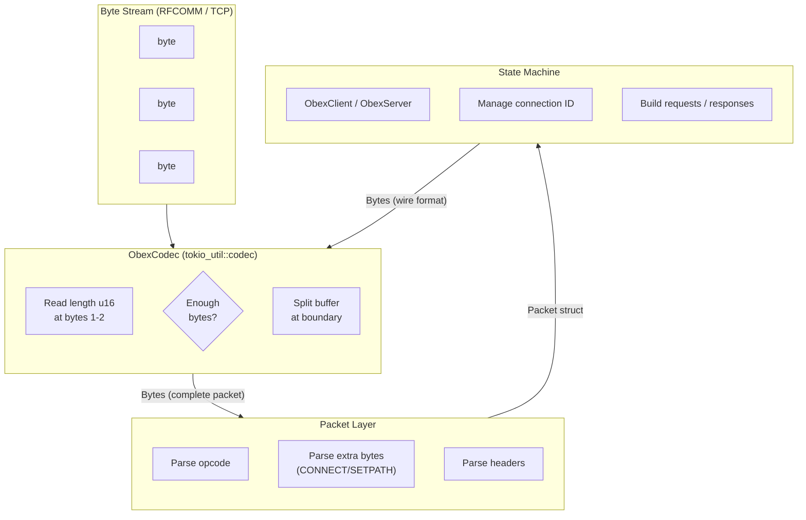

# OBEX Transport Layer

The OBEX transport layer sits at the boundary between the byte stream provided by a Bluetooth RFCOMM channel (or any other reliable bytestream transport) and the structured request-response protocol that higher-level profiles like PBAP and MAP use to exchange data. Understanding this layer requires examining three distinct concerns: **framing** (turning a stream of bytes into discrete packets), **packet structure** (the internal layout of those packets), and **session state** (how the client and server coordinate across multiple exchanges). This layer deliberately separates I/O from protocol logic—a design choice that mirrors the "sans-I/O" pattern seen in other modern protocol implementations and enables the same OBEX machinery to work over RFCOMM, TCP, or any other bytestream.

## Framing: From Bytes to Packets

OBEX uses **length-prefix framing**: every packet begins with a three-byte header containing the total packet length in big-endian u16 format. This design allows a receiver to buffer data until a complete packet arrives, then hand that packet to the protocol layer for parsing. The framing layer does not interpret the packet contents—it simply ensures that the caller receives only complete, well-formed OBEX packets.



The decoder reads bytes 1–2 (the length field), checks that the declared length is at least 3 bytes (the minimum valid OBEX packet), and returns `None` if insufficient data is available. Once enough bytes have arrived, it splits the buffer at the declared boundary and returns the packet as a `Bytes` instance. The encoding side is trivial—packets already carry their own length field, so the codec simply copies the provided bytes into the destination buffer.

In this implementation, framing is implemented by `ObexCodec`, a [`tokio_util::codec::Framed`] codec:

```rust
// crates/imsg-obex/src/codec.rs, lines 18-33
fn decode(&mut self, src: &mut BytesMut) -> Result<Option<Self::Item>, Self::Error> {
    if src.len() < 3 {
        return Ok(None);
    }
    let length_bytes: [u8; 2] =
        src.get(1..3).and_then(|s| s.try_into().ok()).ok_or(TransportError::UnexpectedEof)?;
    let declared = usize::from(u16::from_be_bytes(length_bytes));
    if declared < 3 {
        return Err(TransportError::InvalidLength { declared });
    }
    if src.len() < declared {
        src.reserve(declared.saturating_sub(src.len()));
        return Ok(None);
    }
    Ok(Some(src.split_to(declared).freeze()))
}
```

The decoder reads bytes 1–2 (the length field), checks that the declared length is at least 3 bytes (the minimum valid OBEX packet), and returns `None` if insufficient data is available. Once enough bytes have arrived, it splits the buffer at the declared boundary and returns the packet as a `Bytes` instance. The encoding side is trivial—packets already carry their own length field, so the codec simply copies the provided bytes into the destination buffer.

This framing approach has a direct consequence for error handling: if the remote sends a packet with a length field smaller than 3, the local implementation rejects it as malformed. The OBEX specification requires a minimum packet size of 3 bytes (opcode + length), and the codec enforces this invariant at the earliest possible point.

The `TransportError` enum captures the failure modes specific to this layer:

```rust
// crates/imsg-obex/src/lib.rs, lines 25-42
pub enum TransportError {
    Io(#[from] std::io::Error),
    InvalidLength { declared: usize },
    UnexpectedEof,
    External(String),
}
```

`InvalidLength` and `UnexpectedEof` are framing-specific errors, while `Io` propagates OS-level socket errors and `External` carries errors from wrapper transports (QUIC, TLS, or custom drivers). This separation allows callers to distinguish between a malformed packet (which might indicate a protocol bug or attack) and a transport failure (which might be transient).

## Packet Structure: Opcode, Extras, and Headers

Once the framing layer delivers a complete packet, the **packet layer** parses its contents. Every OBEX packet contains three regions:

1. **Opcode** (1 byte): identifies the operation (CONNECT, DISCONNECT, PUT, GET, SETPATH, ABORT) or response code (OK, Continue, BadRequest, etc.)
2. **Optional fixed bytes**: present only for CONNECT and SETPATH packets, containing protocol negotiation parameters
3. **Headers**: variable-length tagged values carrying the actual payload (names, types, body chunks, application parameters)

The `Packet` struct represents this structure:

```rust
// crates/imsg-obex/src/packet.rs, lines 159-168
pub struct Packet {
    pub opcode: OpCode,
    pub extra: PacketExtra,
    pub headers: Vec<Header>,
}
```

The `OpCode` enum captures both request opcodes (0x80 CONNECT, 0x02 PUT, 0x83 GET FINAL, etc.) and response codes (0xA0 OK, 0x90 CONTINUE, 0xC0 BAD_REQUEST). The `is_ok()` and `is_continue()` helper methods are used extensively by callers to determine how to proceed with a multi-packet exchange:

```rust
// crates/imsg-obex/src/packet.rs, lines 123-133
pub const fn is_ok(self) -> bool {
    matches!(self, Self::Ok | Self::Created)
}

pub const fn is_continue(self) -> bool {
    matches!(self, Self::Continue)
}
```

The `PacketExtra` enum handles the fixed-byte sections that only appear for specific opcodes:

```rust
// crates/imsg-obex/src/packet.rs, lines 136-157
pub enum PacketExtra {
    None,
    Connect { version: u8, flags: u8, max_packet: u16 },
    SetPath { flags: u8, constants: u8 },
}
```

CONNECT carries the OBEX version (0x10 = v1.0), flags, and the maximum packet size the sender can accept. SETPATH carries navigation flags (backup to parent, do not create). All other opcodes use `PacketExtra::None`.

The **header layer** (`Header` enum) represents the variable-length data within each packet. OBEX headers use a tag-byte + length + value encoding, with four distinct formats distinguished by the high bits of the tag byte:

```rust
// crates/imsg-obex/src/headers.rs, lines 23-48
pub enum Header {
    Name(String),           // UTF-16BE, null-terminated
    Type(Bytes),            // null-terminated ASCII
    Length(u32),            // 4-byte unsigned
    Target(Bytes),          // 16-byte UUID
    Who(Bytes),             // 16-byte UUID
    Body(Bytes),            // chunk of object body
    EndOfBody(Bytes),       // final chunk
    AppParams(Bytes),       // profile-specific TLV
    ConnectionId(u32),      // session handle
    Srm(u8),                // Single Response Mode
    Unknown(u8, Bytes),     // unrecognized tag
}
```

The header decoder in `decode_one` determines the format by examining bits 6–7 of the tag byte, then reads the appropriate length and value:

```rust
// crates/imsg-obex/src/headers.rs, lines 139-194
fn decode_one(original: &Bytes, input: &mut &[u8]) -> Result<Header, PacketError> {
    let id = be_u8(input).map_err(|_: ContextError| PacketError::InvalidHeader)?;
    let kind = (id >> 6) & 0x03;
    let header = match kind {
        0 => { /* variable-length Unicode, e.g. Name */ }
        1 => { /* variable-length bytes, e.g. Type, Body */ }
        2 => { /* 1-byte value, e.g. Srm */ }
        3 => { /* 4-byte value, e.g. ConnectionId */ }
        // ...
    };
    Ok(header)
}
```

This design allows OBEX to carry diverse payload types within a unified encoding scheme. The `ConnectionId` header is particularly important: after a successful CONNECT exchange, both client and server must include the assigned connection ID in every subsequent request and response.

## Session State: Client and Server State Machines

The packet layer handles encoding and decoding, but the **state machine layer** manages the protocol's conversational flow. This implementation provides two symmetric state machines: `ObexClient` and `ObexServer`. Both are "sans-I/O"—they produce and consume `Bytes` but delegate actual I/O to the caller.

### The Client State Machine

The client begins in a `Disconnected` state and transitions to `Connected` after a successful CONNECT exchange:

```rust
// crates/imsg-obex/src/client.rs, lines 38-41
enum State {
    Disconnected,
    Connected { conn_id: u32, max_packet: u16 },
}
```

The `connect_request` method builds a CONNECT packet with the profile's UUID as the `Target` header:

```rust
// crates/imsg-obex/src/client.rs, lines 61-79
pub fn connect_request(
    target_uuid: &[u8; 16],
    app_params: Option<Bytes>,
) -> Result<Bytes, ObexError> {
    let mut headers = vec![Header::Target(Bytes::copy_from_slice(target_uuid))];
    if let Some(params) = app_params {
        headers.push(Header::AppParams(params));
    }
    Ok(Packet {
        opcode: OpCode::Connect,
        extra: PacketExtra::Connect { ... },
        headers,
    }.encode()?)
}
```

After sending this request, the caller receives the response bytes and passes them to `handle_connect_response`, which validates the response and extracts the server-assigned connection ID:

```rust
// crates/imsg-obex/src/client.rs, lines 86-98
pub fn handle_connect_response(&mut self, data: &Bytes) -> Result<u32, ObexError> {
    let packet = Packet::decode_connect_response(data)?;
    if !packet.opcode.is_ok() {
        return Err(ObexError::ConnectRejected(packet.opcode.to_byte()));
    }
    let conn_id = packet.header_connection_id().ok_or(ObexError::MissingConnectionId)?;
    self.state = State::Connected { conn_id, max_packet };
    Ok(conn_id)
}
```

Once connected, the client can issue operations. The `get_request`, `put_final_request`, `setpath_request`, and `disconnect_request` methods all require an active connection—they return `ObexError::NotConnected` if called prematurely. Each method automatically includes the `ConnectionId` header in the request, relieving the caller from managing this detail.

### The Server State Machine

The server is simpler than the client because it is largely reactive. It maintains only a counter for assigning connection IDs:

```rust
// crates/imsg-obex/src/server.rs, lines 15-18
pub struct ObexServer {
    next_conn_id: u32,
}
```

The `handle_connect` method processes an incoming CONNECT request, assigns a new connection ID, and returns both the decoded request packet and the response to send:

```rust
// crates/imsg-obex/src/server.rs, lines 32-54
pub fn handle_connect(
    &mut self,
    data: &Bytes,
    who_uuid: &[u8; 16],
) -> Result<(Packet, Bytes), ObexError> {
    let packet = Packet::decode(data)?;
    let conn_id = self.next_conn_id;
    self.next_conn_id = self.next_conn_id.saturating_add(1);
    let rsp = Packet {
        opcode: OpCode::Ok,
        extra: PacketExtra::Connect { ... },
        headers: vec![
            Header::ConnectionId(conn_id),
            Header::Who(Bytes::copy_from_slice(who_uuid)),
        ],
    }.encode()?;
    Ok((packet, rsp))
}
```

The server does not validate the `Target` UUID itself—that responsibility is delegated to the caller (the profile-specific server, such as `MnsServer`). This keeps the OBEX layer generic and reusable.

The `handle_put` method processes incoming PUT requests (used by MAP for event reports):

```rust
// crates/imsg-obex/src/server.rs, lines 61-70
pub fn handle_put(data: &Bytes) -> Result<(Option<Bytes>, Bytes), ObexError> {
    let packet = Packet::decode(data)?;
    let body = packet.headers.iter().find_map(|h| match h {
        Header::EndOfBody(b) | Header::Body(b) => Some(b.clone()),
        _ => None,
    });
    Ok((body, Self::ok_response()))
}
```

The server returns the body payload (if present) along with a fixed OK response `[0xA0, 0x00, 0x03]`. This response is pre-encoded as a static byte array to avoid allocation on every PUT:

```rust
// crates/imsg-obex/src/server.rs, lines 72-76
pub const fn ok_response() -> Bytes {
    Bytes::from_static(&[0xA0, 0x00, 0x03])
}
```

## Multi-Packet Operations and the Continue Response

OBEX is not a streaming protocol—it is a request-response protocol where each request and response fits in a single packet. However, when the data exceeds the negotiated maximum packet size, the protocol supports **chaining**: the sender transmits a partial body with the `Continue` response code (0x90), the receiver sends another request to fetch the next chunk, and this continues until the final chunk arrives with `OK`.

The MAP client demonstrates this pattern in its `collect_body` method:

```rust
// crates/imsg-map/src/client/mod.rs, lines 56-87
async fn collect_body(&mut self) -> Result<Vec<u8>, MapError> {
    let mut body = Vec::with_capacity(512);
    loop {
        let rsp_bytes = Self::recv(&mut self.transport).await?;
        let rsp = ObexClient::parse_response(&rsp_bytes)?;
        if rsp.opcode.is_continue() {
            if let Some(chunk) = rsp.body_payload() {
                body.extend_from_slice(chunk);
            }
            let cont = self.obex.get_continue_request()?;
            self.transport.send(cont).await?;
        } else if rsp.opcode.is_ok() {
            if let Some(chunk) = rsp.body_payload() {
                body.extend_from_slice(chunk);
            }
            break;
        } else {
            return Err(MapError::ServerError(rsp.opcode.to_byte()));
        }
    }
    Ok(body)
}
```

This loop handles the common case where a large message listing or phonebook download arrives in multiple OBEX packets. The client checks each response: if it's `Continue`, it appends the body chunk and sends a continuation request; if it's `OK`, it appends the final chunk and exits; any other response is treated as an error.

The OBEX layer itself does not implement this chaining—it merely provides the `is_continue()` predicate and the `get_continue_request()` helper. The chaining logic lives in the profile layer because different profiles may have different continuation semantics (MAP uses GET CONTINUE, for example, while other profiles might use PUT CONTINUE).

## Integration with Higher-Level Profiles

The OBEX transport layer is an implementation detail that higher-level profiles compose with their own state machines. Both PBAP and MAP follow the same pattern:

1. **Wrap the stream**: `wrap(stream)` creates a framed transport
2. **Create the OBEX state machine**: `ObexClient::new()` or `ObexServer::new()`
3. **Perform CONNECT**: exchange the profile's UUID as the `Target` header
4. **Execute profile operations**: use the OBEX packet builder methods to construct requests
5. **Handle responses**: parse the response packets, handle multi-packet continuation if needed
6. **DISCONNECT**: send a DISCONNECT request and process the response

The PBAP client shows this clearly:

```rust
// crates/imsg-pbap/src/client/mod.rs, lines 41-49
pub async fn connect(stream: T) -> Result<Self, PbapError> {
    let mut transport = wrap(stream);
    let mut obex = ObexClient::new();
    let req = ObexClient::connect_request(&PBAP_UUID, Some(connect_params()))?;
    transport.send(req).await?;
    let rsp = Self::recv(&mut transport).await?;
    obex.handle_connect_response(&rsp)?;
    Ok(Self { obex, transport })
}
```

The MAP client is nearly identical, differing only in the UUID and the absence of application parameters in the CONNECT request. The MNS server (which accepts incoming MAP connections) uses the server state machine in the same way.

## Design Rationale and Trade-offs

The separation of framing, packet parsing, and state management reflects several deliberate design choices:

**Sans-I/O architecture**: By isolating protocol logic from I/O, the same `ObexClient` and `ObexServer` can operate over RFCOMM, a Unix pipe, or an in-memory channel for testing. The caller provides the `Framed` transport, and the state machine operates on `Bytes` objects. This also makes the code easier to test—packet encoding and decoding can be verified without network I/O.

**Zero-copy parsing**: The packet decoder uses `zerocopy` to parse wire formats directly from the `Bytes` buffer without copying. The header decoder similarly creates `Bytes` slices that reference the original buffer rather than allocating new storage. This is important for Bluetooth profiles that may handle large phonebook dumps or message listings.

**Static response pre-allocation**: The server's `ok_response()` and `bad_request_response()` methods return statically allocated `Bytes`. This avoids a heap allocation on every PUT response, which matters when the server may handle many rapid event reports.

**Explicit connection IDs**: Rather than hiding the connection ID in implicit session state, the protocol makes it an explicit header that must be included in every request after CONNECT. This makes the protocol's session model transparent and easier to debug.

**Error specificity**: The `ObexError` and `PacketError` enums distinguish between different failure modes (connection rejected, missing connection ID, malformed packet, invalid header). This allows callers to implement targeted error handling—for example, treating a `ConnectRejected` response differently from a transport failure.

## Related Concepts

- The [Packet Structure](#packet-structure-opcode-extras-and-headers) reference page provides detailed specifications for each opcode and header encoding.
- The [PBAP Session Flow](pbap-client-walkthrough.md) and [MAP Session Flow](map-client-walkthrough.md) pages trace the complete request-response sequences for each profile.
- The [Transport](../transport/index.md) section covers the underlying stream connectors the framing layer wraps: RFCOMM for Bluetooth Classic and iroh QUIC for remote hub/spoke.