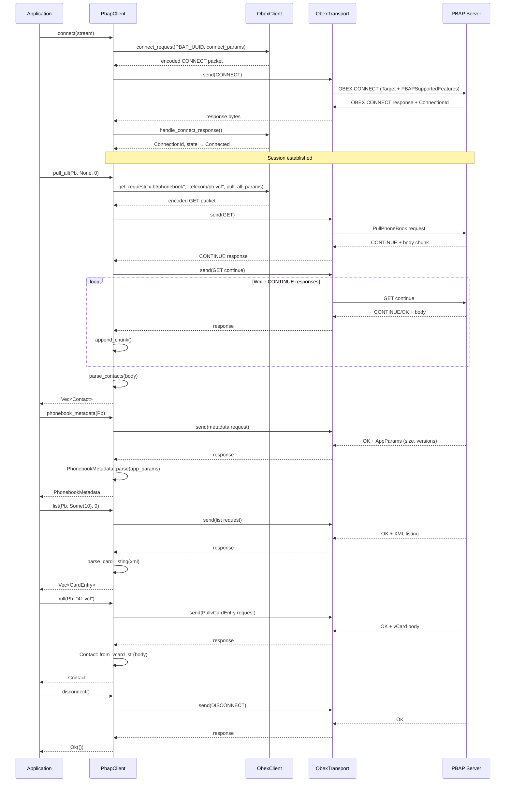

# Using the PBAP Client

This page traces the end-to-end flow of a PBAP (Phone Book Access Profile) client operation, from establishing a connection to retrieving individual contacts. The flow follows how a concrete operation moves through the system, illuminating the participating components, ordering, state transitions, and data movement.

## Operation Overview

The primary flow traced here is: **connecting to a PBAP server, pulling a full phonebook, fetching phonebook metadata, and retrieving an individual contact by handle**. This represents the common sequence a client follows when synchronizing contacts from a Bluetooth device.

### Starting Conditions

- A connected Bluetooth RFCOMM stream to a PBAP-capable device
- The stream implements `AsyncRead + AsyncWrite + Unpin` (typically from `tokio::io`)
- No PBAP session is active; the client begins in a disconnected state

### Participating Components

| Component | Role |
|---|---|
| `PbapClient<T>` | Owns the OBEX state machine and transport; exposes high-level PBAP operations |
| `ObexClient` | Sans-IO OBEX client state machine; encodes requests, decodes responses |
| `ObexTransport<T>` | Framed I/O layer using `ObexCodec`; handles OBEX packet boundaries |
| `PhonebookPath` | Enumerates available phonebooks (Pb, Ich, Och, Mch, Cch, Spd, Fav) |
| `PhonebookMetadata` | Parsed metadata from `AppParams` header (size, database_id, version counters) |
| `Contact` | Parsed vCard contact from the `formats` crate |
| `CardEntry` | Lightweight listing entry from `ListvCardObjects` (handle + display name) |

### Terminal State

After a complete flow, the client holds:
- A connected OBEX session with a `ConnectionId`
- A collection of parsed `Contact` structs
- Metadata about the phonebook including version counters for change detection
- The ability to retrieve any individual contact by its handle

---

## Flow Diagram



---

## Phase 1: Session Establishment

### Initiation

The application provides a connected `AsyncRead + AsyncWrite` stream (typically an RFCOMM channel from a Bluetooth library). The client begins by wrapping this stream in an `ObexTransport` and creating a fresh `ObexClient` in the disconnected state.

### Connection Request Construction

The `PbapClient::connect` method constructs an OBEX CONNECT request with:

1. **Target header**: The 16-byte PBAP UUID (`0x79 0x61 0x35 0xf0...`) identifying the PBAP service
2. **AppParams header**: `PBAPSupportedFeatures` declaring `Download | DatabaseIdentifier | FolderVersionCounters` (bitmask `0x0000000D`)

The `connect_params()` function in `params.rs` encodes this as `[0x10, 0x04, 0x00, 0x00, 0x00, 0x0D]` — a required declaration to unlock metadata fields in subsequent responses.

```rust
// From params.rs lines 14-16
pub const fn connect_params() -> Bytes {
    Bytes::from_static(b"\x10\x04\x00\x00\x00\x0d")
}
```

### Transport and Response Handling

The request is sent through the framed transport, which handles OBEX packet length-prefixing via `ObexCodec`. The client receives the response and delegates to `ObexClient::handle_connect_response`, which:

1. Validates the response opcode is OK (not a rejection)
2. Extracts the `ConnectionId` header — required for all subsequent requests
3. Transitions the OBEX client state to `Connected`

### State Change

| Before | After |
|---|---|
| `ObexClient` in `State::Disconnected` | `ObexClient` in `State::Connected { conn_id, max_packet }` |
| No `ConnectionId` | `ConnectionId` assigned by server |

### Failure Conditions

- **Server rejects CONNECT**: Returns `PbapError::Obex(ObexError::ConnectRejected(opcode))`
- **Missing ConnectionId**: Returns `PbapError::Obex(ObexError::MissingConnectionId)` — the session cannot be used
- **Transport failure**: Returns `PbapError::Transport(TransportError)`

---

## Phase 2: Pulling the Full Phonebook

### Initiation

The application calls `pbap_client.pull_all(PhonebookPath::Pb, None, 0)` to fetch the main phonebook. The `limit: None` and `offset: 0` arguments request all entries without pagination.

### Request Construction

The `pull_all` method builds a GET request with:

- **Type**: `x-bt/phonebook\x00` (null-terminated)
- **Name**: The phonebook path, e.g., `telecom/pb.vcf` (from `PhonebookPath::pull_name()`)
- **AppParams**: `Format=vcard30`, `PROPERTY_SELECTOR`, `MaxListCount` (see `pull_all_params` in `params.rs`)

The `PROPERTY_SELECTOR` (`0x0000000000200083`) requests only the vCard fields this crate actually parses: VERSION, FN, TEL, and UID. This dramatically reduces payload size — a 400KB pull becomes ~18KB.

```rust
// From params.rs lines 31-42
pub fn pull_all_params(limit: Option<u16>, offset: u16) -> Bytes {
    let mut out = Vec::with_capacity(21);
    out.extend_from_slice(b"\x07\x01\x01");  // Format = vCard 3.0
    out.extend_from_slice(PROPERTY_SELECTOR);
    out.extend_from_slice(&[0x04, 0x02]);    // MaxListCount tag
    out.extend_from_slice(&limit.unwrap_or(u16::MAX).to_be_bytes());
    if offset != 0 {
        out.extend_from_slice(&[0x05, 0x02]); // ListStartOffset tag
        out.extend_from_slice(&offset.to_be_bytes());
    }
    Bytes::from(out)
}
```

### CONTINUE Loop and Body Accumulation

PBAP servers may respond with multiple CONTINUE (0x90) packets before the final OK (0xA0). The `collect_response` method in `io.rs` handles this:

1. Receives the initial response
2. If CONTINUE: appends the body chunk, sends a continue request, loops
3. If OK: appends the final chunk and returns
4. Any other opcode: returns `PbapError::ServerError`

```rust
// From client/io.rs lines 24-45
pub(super) async fn collect_response(&mut self) -> Result<(Vec<u8>, Option<Bytes>), PbapError> {
    let mut body = Vec::with_capacity(4096);
    let mut app_params = None;
    loop {
        let rsp_bytes = Self::recv(&mut self.transport).await?;
        let rsp = ObexClient::parse_response(&rsp_bytes)?;
        if let Some(params) = rsp.header_app_params() {
            app_params = Some(Bytes::copy_from_slice(params));
        }
        if rsp.opcode.is_continue() {
            Self::append_chunk(&mut body, rsp.body_payload())?;
            let cont = self.obex.get_continue_request()?;
            self.transport.send(cont).await?;
        } else if rsp.opcode.is_ok() {
            Self::append_chunk(&mut body, rsp.body_payload())?;
            break;
        } else {
            return Err(PbapError::ServerError(rsp.opcode.to_byte()));
        }
    }
    Ok((body, app_params))
}
```

### Body Parsing

The accumulated body is UTF-8 text containing one or more vCard blocks. The `parse_contacts` function in `contacts.rs` splits on `END:VCARD\r\n`, filters for blocks containing `BEGIN:VCARD`, and parses each with the `calcard` crate:

```rust
// From contacts.rs lines 86-93
pub(crate) fn parse_contacts(body: &[u8]) -> Result<Vec<Contact>, PbapError> {
    let text = std::str::from_utf8(body).map_err(|_| PbapError::InvalidEncoding)?;
    Ok(text
        .split_inclusive("END:VCARD\r\n")
        .filter(|block| block.contains("BEGIN:VCARD"))
        .filter_map(|block| Contact::from_vcard_str(block).ok())
        .collect())
}
```

Unparseable vCards are silently skipped — the method returns only the contacts that were successfully parsed.

### Failure Conditions

- **Server error opcode**: Returns `PbapError::ServerError(opcode)`
- **Body exceeds 4 MiB**: Returns `PbapError::ResponseTooLarge`
- **Non-UTF-8 body**: Returns `PbapError::InvalidEncoding`
- **Transport/OBEX failure**: Returns `PbapError::Transport` or `PbapError::Obex`

---

## Phase 3: Fetching Phonebook Metadata

### Initiation

The application calls `pbap_client.phonebook_metadata(PhonebookPath::Pb)` to retrieve metadata without fetching the full phonebook. This is useful for change detection and sizing before a pull.

### Request Construction

The request is identical to `pull_all` except `MaxListCount=0` in the AppParams, signaling a metadata-only request:

```rust
// From params.rs lines 109-111
pub const fn metadata_params() -> Bytes {
    Bytes::from_static(b"\x07\x01\x01\x04\x02\x00\x00")  // Format=vCard30, MaxListCount=0
}
```

### Response Parsing

The server responds with OK but no vCard body. Instead, it includes `AppParams` with metadata fields. The `PhonebookMetadata::parse` method extracts recognized TLV entries:

| Tag | Field | Size |
|---|---|---|
| 0x08 | `size` | 2 bytes (u16) |
| 0x0A | `primary_version` | 16 bytes |
| 0x0B | `secondary_version` | 16 bytes |
| 0x0D | `database_id` | 16 bytes |

```rust
// From metadata.rs lines 27-43
pub(crate) fn parse(app_params: &[u8]) -> Self {
    let mut out = Self::default();
    for (tag, value) in tlv_entries(app_params) {
        match tag {
            0x08 => {
                if let Ok(bytes) = value.try_into() {
                    out.size = Some(u16::from_be_bytes(bytes));
                }
            }
            0x0A => out.primary_version = value.try_into().ok(),
            0x0B => out.secondary_version = value.try_into().ok(),
            0x0D => out.database_id = value.try_into().ok(),
            _ => {}
        }
    }
    out
}
```

### Important Constraint

The `database_id`, `primary_version`, and `secondary_version` fields are only present if the client declared `DatabaseIdentifier` and `FolderVersionCounters` in `PBAPSupportedFeatures` at connect time. The `connect_params()` function includes these features, so they will be populated when connecting through `PbapClient::connect`.

---

## Phase 4: Listing and Searching Contacts

### List Operation

The `list` method retrieves a lightweight listing of contacts without their full vCard bodies. This is useful for building a UI with contact names before fetching details on demand.

The request uses Type `x-bt/vcard-listing\x00` with the phonebook path (e.g., `telecom/pb`) as the Name. The response is XML:

```xml
<?xml version="1.0" encoding="UTF-8"?>
<!DOCTYPE pbap-listing SYSTEM "pbap-vcard-listing.dtd">
<pbap-listing>
  <card handle="41.vcf" name="John Doe"/>
  <card handle="42.vcf" name="Jane Smith"/>
</pbap-listing>
```

The `parse_card_listing` function in `contacts.rs` parses this XML, extracting the `handle` (opaque identifier for `pull`) and `name` (display name) from each `<card>` element.

### Search Operation

The `search` method adds device-side filtering via `SearchAttribute` and `SearchValue` AppParams. The attribute can be:

- `SearchAttribute::Name` — match against contact name
- `SearchAttribute::Number` — match against phone number
- `SearchAttribute::Sound` — match against phonetic sound (for voice dialers)

The search value must be 1–255 UTF-8 bytes and contain no CR or LF. The server returns a filtered vCard listing.

---

## Phase 5: Retrieving an Individual Contact

### Initiation

After obtaining a `CardEntry` from `list` or `search`, the application calls `pbap_client.pull(path, handle)` to fetch the full vCard for a specific contact.

### Request Construction

The request uses Type `x-bt/vcard\x00` with the Name constructed from the phonebook path and handle:

```rust
// From phonebook.rs lines 58-60
pub fn entry_name(self, handle: &str) -> String {
    format!("{}/{}", self.list_name(), handle)
}
// e.g., "telecom/pb/41.vcf" for Pb with handle "41.vcf"
```

The AppParams use `pull_entry_params()`, which includes `Format=vCard30` and the same `PROPERTY_SELECTOR` used for bulk pulls.

### Response Handling

The response body is a single vCard. The client validates UTF-8 encoding and parses with `Contact::from_vcard_str`:

```rust
// From client/mod.rs lines 197-199
let body = self.collect_body().await?;
let text = std::str::from_utf8(&body).map_err(|_| PbapError::InvalidEncoding)?;
Ok(Contact::from_vcard_str(text)?)
```

### Failure Conditions

- **Invalid handle**: Returns `PbapError::InvalidInput` if handle is empty or contains CR/LF
- **Server error**: Returns `PbapError::ServerError(opcode)`
- **Response too large**: Returns `PbapError::ResponseTooLarge` if body exceeds 4 MiB
- **Invalid encoding**: Returns `PbapError::InvalidEncoding` if body is not UTF-8
- **Parse error**: Returns `PbapError::Contact(ContactError)` if calcard cannot parse the vCard

---

## Phase 6: Disconnection

### Initiation

The application calls `pbap_client.disconnect()`. This sends an OBEX DISCONNECT request with the `ConnectionId` header.

### Behavior

The method validates the response opcode is OK but does **not** close the underlying stream — the caller retains ownership and may reuse the transport for other purposes (or must drop it to close the connection).

```rust
// From client/mod.rs lines 107-116
pub async fn disconnect(mut self) -> Result<(), PbapError> {
    let req = self.obex.disconnect_request()?;
    self.transport.send(req).await?;
    let rsp_bytes = Self::recv(&mut self.transport).await?;
    let rsp = ObexClient::parse_response(&rsp_bytes)?;
    if !rsp.opcode.is_ok() {
        return Err(PbapError::ServerError(rsp.opcode.to_byte()));
    }
    Ok(())
}
```

---

## Data Flow Summary

| Phase | Data In | Data Out |
|---|---|---|
| Connect | `AsyncRead + AsyncWrite` stream | `PbapClient` with `ConnectionId` |
| Pull All | `PhonebookPath`, `limit`, `offset` | `Vec<Contact>` |
| Metadata | `PhonebookPath` | `PhonebookMetadata` (size, versions, database_id) |
| List | `PhonebookPath`, `limit`, `offset` | `Vec<CardEntry>` (handles + names) |
| Search | `PhonebookPath`, `SearchAttribute`, `value`, `limit`, `offset` | `Vec<CardEntry>` |
| Pull | `PhonebookPath`, `handle` | `Contact` |
| Disconnect | — | `()` |

### Ownership and Lifetime

- The `PbapClient` owns the `ObexClient` state machine and `ObexTransport`
- The underlying stream is borrowed, not owned — the caller provides it and is responsible for its lifecycle
- After `disconnect`, the client can be dropped; the stream remains open for other uses

### Correlation Identifiers

- The `ConnectionId` assigned by the server at connect time correlates all subsequent requests and responses within the session
- Handles from `CardEntry` are opaque identifiers that correlate a listing entry to a specific `pull` request

---

## Related Documentation

- [OBEX Transport](obex-transport.md) — framed I/O and packet codec
- [Contact Caching](../storage/contact-caching.md) — higher-level caching layer built on PBAP
- [`PbapClient` API reference](../imsg_pbap/client/struct.PbapClient.html) — method signatures and error types
- [`PhonebookPath` enum](../imsg_pbap/phonebook/enum.PhonebookPath.html) — available phonebook paths
- [`PhonebookMetadata` struct](../imsg_pbap/metadata/struct.PhonebookMetadata.html) — metadata fields