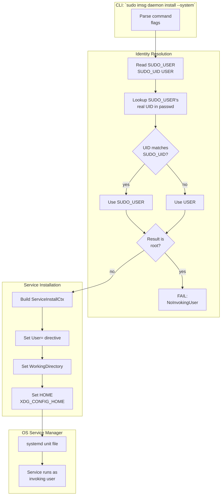

# System Service Identity Resolution

When installing the imsg daemon as a system service—registered with systemd, launchd, or another OS service manager—a fundamental tension emerges: system services traditionally run as root, but the daemon needs access to the invoking user's personal data. The identity resolution system bridges this gap by detecting the real user behind a `sudo` invocation and configuring the service to run as them instead of root.

## The Core Problem

System-level service installation typically requires elevated privileges. On Linux, installing a systemd unit with `sudo imsg daemon install --system` creates a unit that, without special configuration, runs as root. This works fine for services that only need system-wide resources—but imsg is different.

The imsg daemon manages Bluetooth MAP connections to devices, synchronizes messages, and stores configuration. All of these live under the user's personal directory structure:

- **Configuration**: `~/.config/imsg/imsg.toml` contains device addresses, sync preferences, and broker settings
- **Keyring**: The secure storage for Bluetooth authentication tokens lives in the user's keyring (often `~/.local/share/keyring/` or the system keyring daemon under the user's session)
- **Bluetooth pairings**: Device pairing information is stored in the user's Bluetooth configuration, not a system-wide location
- **Message store**: The SQLite database and attachments reside under the user's data directory

If the daemon runs as root, it cannot read any of these resources. A root-run daemon would either fail to find the user's configuration, fall back to empty defaults, or crash when attempting operations that require the user's keyring.

## The Design Decision: Run as the Invoking User

Rather than having the service run as root with a complicated mechanism to "switch" to the user at runtime, the design chooses to run the service as the actual user from the start. This means:

1. The service has direct access to the user's config, keyring, and Bluetooth state
2. No privilege separation or capability swapping is needed at runtime
3. The service inherits the user's session environment naturally
4. Logs and temporary files are written to the correct locations

This approach does require elevated privileges for installation (to register the service with the OS), but the running service operates with normal user privileges—matching how user-level services work, just registered system-wide.

## How Sudo Detection Works

The identity resolution system must reliably detect when a command is run via `sudo` and identify the original user. This is more subtle than it might first appear, because environment variables alone can be spoofed or misleading.

### Environment Variable Strategy

When `sudo` runs a command, it sets several environment variables:

- `SUDO_USER`: The username of the original user
- `SUDO_UID`: The numeric UID of the original user (as a string)
- `USER`: The effective user—typically reset to the target user (root)

A naive implementation might simply read `SUDO_USER` and use that. However, this is vulnerable to manipulation: a malicious user could set `SUDO_USER=alice` and trick the system into running a service as Alice.

### Corroboration Requirement

The implementation in `identity.rs` requires corroboration between `SUDO_USER` and `SUDO_UID`:

```rust
let corroborated = sudo_uid.and_then(|s| s.parse::<u32>().ok()) == sudo_user_uid;
```

The system:
1. Takes `SUDO_USER` and looks up its real UID via the passwd database (`nix::unistd::User::from_name`)
2. Parses `SUDO_UID` as a number
3. Only accepts `SUDO_USER` if the resolved UID matches `SUDO_UID`

This creates a trusted chain: `SUDO_UID` comes from the same `sudo` invocation that set `SUDO_USER`, and the UID verification proves the username is legitimate. If someone simply sets `SUDO_USER=alice` without going through sudo, `SUDO_UID` won't be set or won't match, and the claim is rejected.

### Fallback Behavior

If `SUDO_USER` is not corroborated (missing, unparseable, or mismatched), the system falls back to `$USER`:

```rust
name = sudo_user.filter(|s| !s.is_empty()).filter(|_| corroborated).or(user).unwrap_or_default();
```

This handles the case of a direct login as a normal user—no sudo involved, so `$USER` is already correct.

### Rejecting Bare Root

A critical guard prevents the system from silently accepting root:

```rust
(!name.is_empty() && name != "root").then(|| name.to_owned())
```

If the resolved username is `root` (or empty), the installation fails with `Error::NoInvokingUser`. This prevents two problematic scenarios:

1. **Genuine root login**: A user who logs in directly as root and runs `imsg daemon install --system` should not get a root-run service—they should use `--user` or run as a normal user
2. **Broken environment**: If all detection fails and produces `root` as a fallback, the system refuses rather than silently creating a broken service

## Service Identity Construction

Once the invoking user is resolved, the system builds a `ServiceIdentity` tuple containing:

```rust
pub(crate) type ServiceIdentity = (Option<String>, Option<PathBuf>, Option<Vec<(String, String)>>);
//                                    username           home_dir              environment
```

### Username

The resolved username is passed to the service manager. On systemd, this becomes the `User=` directive in the unit file, causing the service to fork into that user after privilege drop.

### Working Directory

The user's home directory becomes the service's working directory. This ensures relative path resolution works correctly for any config files or data paths the daemon accesses.

### Environment Variables

Two critical environment variables are set:

```rust
let env = vec![
    ("HOME".to_owned(), user.dir.to_string_lossy().into_owned()),
    ("XDG_CONFIG_HOME".to_owned(), config_home),
];
```

- `HOME`: Many tools and libraries check this for config locations
- `XDG_CONFIG_HOME`: The standard XDG base directory for user configuration (defaults to `$HOME/.config`)

These ensure that when the daemon starts, it sees the same configuration paths as the user's interactive sessions.

## Integration with Service Installation

The identity resolution integrates with the service-manager crate through `ServiceInstallCtx`:

```rust
let ctx = ServiceInstallCtx {
    label: label(),
    program,
    args: start_foreground_args(device, config_path),
    contents: None,
    username,           // The resolved invoking user
    working_directory,  // Their home directory
    environment,        // HOME and XDG_CONFIG_HOME
    autostart: true,
    restart_policy: RestartPolicy::default(),
};
manager(level)?.install(ctx).map_err(Error::Operation)
```

The service manager (systemd, launchd, etc.) uses these fields to configure how the service process runs. On systemd, this produces a unit with directives like:

```ini
[Service]
ExecStart=/usr/bin/imsg daemon start --foreground --device AA:BB:CC:DD:EE:FF
User=alice
WorkingDirectory=/home/alice
Environment="HOME=/home/alice"
Environment="XDG_CONFIG_HOME=/home/alice/.config"
```

## Reuse for Config Resolution

The identity resolution isn't only for the service itself. When installing with `--system`, the CLI also needs to read the user's config to resolve the default device address:

```rust
fn default_device(config_path: Option<PathBuf>, system: bool) -> Result<String> {
    if system && config_path.is_none() {
        let home = service::invoking_home().context("resolving config for --system install")?;
        let explicit = home.join(".config/imsg/imsg.toml");
        return Ok(load(Some(explicit))?.device.address().to_owned());
    }
    // ...
}
```

This uses the same `invoking_home()` function that the service installation uses, ensuring consistency: the CLI reads from the same config location that the installed service will use.

## Security Considerations

The design makes several security-conscious choices:

1. **No silent fallback to root**: The explicit rejection of bare `root` prevents accidental root-run services
2. **UID corroboration**: Requiring `SUDO_UID` to match prevents environment variable spoofing
3. **Passwd database verification**: The resolved username is looked up in the system passwd database to get the actual UID and home directory, not trusting the environment variable directly
4. **Minimal privilege**: The service runs with the minimum privileges needed—normal user, not root

## Alternatives Considered

Several alternative approaches were considered and rejected:

- **Runtime user switching**: Using setuid binaries or privilege dropping at runtime adds complexity and potential failure points
- **Reading config as root, then switching**: Would require the daemon to re-read config after starting, complicating initialization
- **System-wide config storage**: Would break the user's existing configuration and keyring integration
- **Trusting SUDO_USER alone**: Without UID corroboration, this is vulnerable to environment variable injection

The chosen approach—resolving the user at install time and configuring the service to run as them—provides the simplest mental model and the most reliable operation.

## Conceptual Architecture

The following diagram illustrates how identity resolution flows from the CLI through to the installed service:



The flow shows:
1. **Environment reading**: The system reads the sudo and user environment variables
2. **Corroboration**: The claimed username's real UID is verified against `SUDO_UID`
3. **Fallback**: If not corroborated, it falls back to `$USER`
4. **Guard**: Bare root is rejected to prevent broken installations
5. **Construction**: The service context is built with username, home, and environment
6. **Installation**: The service manager creates a unit that runs as the invoking user

## Summary

System service identity resolution addresses a specific problem: system services need to run as root to be installed, but imsg needs user-level resources. Rather than complicating the running service with runtime detection, the system detects the invoking user at install time (via sudo environment variable corroboration), rejects ambiguous cases (bare root), and configures the service to run as the actual user with correct environment variables. This ensures the daemon has access to the user's config, keyring, and Bluetooth state while still being installable with elevated privileges.