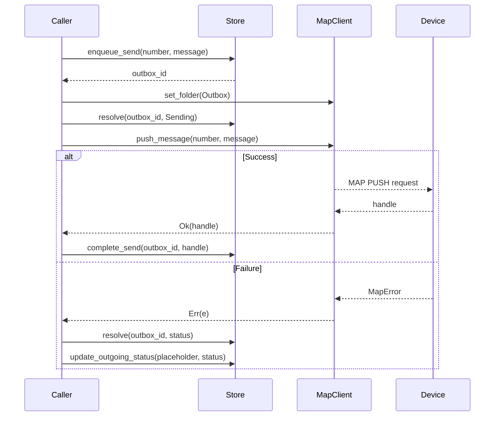
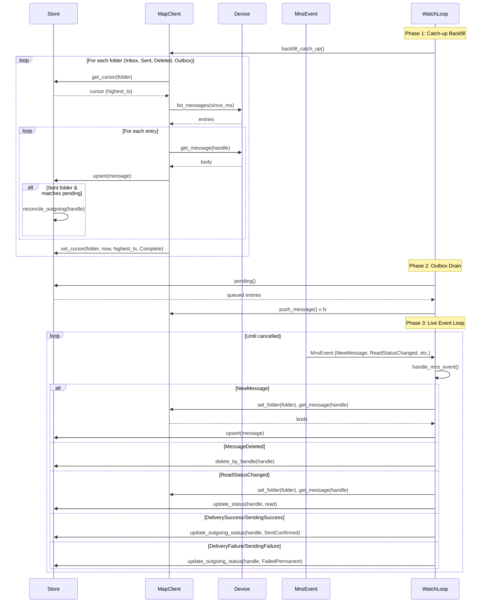

# Sending Messages and Continuous Sync

This document traces two interrelated flows: the outbox-based message sending path and the continuous synchronization loop that keeps the local message store in sync with the device. Both flows operate over a live MAP (Message Access Profile) session and share the same `MapClient` instance.

## Operation Context

The system operates with two distinct data paths:

1. **Live queries** — read directly from the device without persisting, used for immediate UI display
2. **Persistent sync** — ingests messages into a local SQLite store with cursor-based incremental backfill

The sending and sync flows belong to the persistent path. They assume an established MAP session with notification registration enabled (see [Connection Establishment](./connection-establishment.md) for the handshake sequence).

---

## Flow 1: Sending a Message Through the Outbox

### Starting Conditions

- A `MapClient<T>` is connected and has MNS notification registration active
- A `Store` instance provides SQLite persistence
- The caller has a recipient phone number and message text

### Sequence Diagram



### Phase 1: Outbox Entry Creation

The caller invokes `outbox::send_sms`, passing the `MapClient`, `Store`, recipient number, message text, and current timestamp.

```rust
// crates/imsg-session/src/outbox.rs, lines 68-93
let params = format!("{number}\x1F{message}");
let (_, outbox_id) = store
    .enqueue_send(
        NewMessage {
            map_handle: String::new(),
            timestamp_ms: now,
            folder: Folder::Sent.as_str().to_owned(),
            direction: Direction::Sent,
            address: PhoneField::new(number, None),
            status: STATUS_READ,
            synced_at: now,
            text: message.to_owned(),
            outgoing_status: Some(OutgoingStatus::Queued),
        },
        "send_sms",
        &params,  // payload: "{number}\x1F{message}"
        now,
    )
    .await?;
```

The store creates two records:

1. An **outbox row** with `OutboxStatus::Queued`, carrying the payload `"{number}\x1F{message}"` used later by the drain loop
2. A **message row** in the Sent folder with `outgoing_status = Queued`, representing the speculative local record

The `outbox_id` returned identifies the outbox row; the message row uses a placeholder `local:{outbox_id}` as its `map_handle`.

### Phase 2: MAP Push Execution

The client navigates to the Outbox folder and pushes the message:

```rust
// crates/imsg-session/src/outbox.rs, lines 96-116
client.set_folder(Folder::Outbox).await?;
store.resolve(outbox_id, OutboxStatus::Sending, now, None).await?;

match client.push_message(number, message).await {
    Ok(handle) => {
        store.complete_send(outbox_id, &placeholder, &handle, now).await?;
        Ok(format!("sent to {number} (handle {handle})"))
    }
    Err(e) => {
        let (outbox_status, outgoing_status) = classify_push_error(&e);
        // ... update store with failure state
        Err(anyhow::Error::from(e))
    }
}
```

**On success**: The store updates the outbox row to `OutboxStatus::Sent` and the message row receives the real device-assigned MAP handle, transitioning `outgoing_status` to `SentConfirmed`.

**On failure**: The error is classified via `classify_push_error`:

| Error Type | Outbox Status | Outgoing Status |
|------------|---------------|-----------------|
| `Transport` / `UnexpectedEof` | `Unknown` | `Unknown` |
| `InvalidInput` / `ServerError` | `Failed` | `FailedPermanent` |
| Other (OBEX, encoding, parse) | `Failed` | `FailedRetryable` |

Transport errors are ambiguous—the message may have been delivered before the connection dropped, so the status remains `Unknown` and requires reconciliation against the Sent folder.

### Outbox Drain (Background)

When the watch loop starts or resumes, it drains any pending outbox entries before processing live events:

```rust
// crates/imsg-session/src/outbox.rs, lines 152-166
pub async fn drain_outbox<T: AsyncRead + AsyncWrite + Unpin>(
    client: &mut MapClient<T>,
    store: &Store,
    now: i64,
) -> anyhow::Result<()> {
    let pending = store.pending().await?;  // OutboxStatus::Queued
    if pending.is_empty() { return Ok(()); }
    client.set_folder(Folder::Outbox).await?;
    for entry in pending {
        process_entry(client, store, entry, now).await;
    }
    Ok(())
}
```

Each entry is processed independently; failures are logged but do not abort the remaining entries.

---

## Flow 2: Continuous Sync — The Watch Loop

### Starting Conditions

- A `MapClient<T>` connected with MNS notifications enabled
- A `Store` with per-folder cursors tracking the last-synced timestamp
- An `mpsc::Receiver<MnsEvent>` receiving device-pushed notification events
- A `watch::Receiver<bool>` for graceful shutdown signaling

### Sequence Diagram



### Phase 1: Catch-up Backfill

Before processing live events, the watch loop runs an incremental backfill to ingest messages that arrived while the session was down:

```rust
// crates/imsg-session/src/watch/mod.rs, lines 170-177
pub async fn run_watch<T: AsyncRead + AsyncWrite + Unpin>(
    event_rx: &mut mpsc::Receiver<MnsEvent>,
    client: &mut MapClient<T>,
    store: &Store,
    mut cancel_rx: watch::Receiver<bool>,
) -> anyhow::Result<()> {
    backfill_catch_up(client, store).await?;
    drain_outbox(client, store, now_ms()).await?;
    // ... event loop
}
```

The backfill processes each MAP folder independently:

```rust
// crates/imsg-session/src/sync.rs, lines 36-65
async fn backfill_folder<T: AsyncRead + AsyncWrite + Unpin>(
    client: &mut MapClient<T>,
    store: &Store,
    folder: Folder,
    now: i64,
) -> anyhow::Result<()> {
    let cursor = store.get_cursor(folder.as_str()).await?;
    let since_ms = cursor.as_ref().map(|c| c.highest_ts);
    // ... fetch messages since cursor
    for msg in fetch_folder(client, folder, since_ms, now, &template).await? {
        store.upsert(to_new_message(msg, now)).await?;
        // Reconcile: if Sent message matches pending outbox, confirm it
        if is_sent {
            store.reconcile_outgoing(&handle).await?;
        }
    }
    store.set_cursor(folder_str, now, highest_ts_seen, FolderSyncStatus::Complete).await?;
    Ok(())
}
```

**Cursor semantics**: Each folder maintains a cursor with `highest_ts` — the highest timestamp seen in the last successful sync. On the next run, only messages with `timestamp_ms > highest_ts` are fetched. If a folder has no cursor, a full fetch is performed.

**Sent folder reconciliation**: When a message appears in the Sent folder during backfill, the store checks whether it matches a pending outbox entry (created by `send_sms` before the device confirmed delivery). If so, the `outgoing_status` advances from `Queued` to `SentConfirmed`, resolving the ambiguity from transport errors.

### Phase 2: Outbox Drain

After backfill, any messages that failed to send during a previous session are retried:

```rust
// crates/imsg-session/src/watch/mod.rs, line 177
drain_outbox(client, store, now_ms()).await?;
```

This ensures pending messages are delivered before the live event loop begins, preventing a race where a newly sent message is overwritten by an older device state.

### Phase 3: Live Event Processing

The loop waits for MNS (Message Notification Service) events pushed by the device:

```rust
// crates/imsg-session/src/watch/mod.rs, lines 178-190
loop {
    tokio::select! {
        biased;
        _ = cancel_rx.changed() => {
            if *cancel_rx.borrow() { break; }
        }
        event = event_rx.recv() => {
            let Some(ev) = event else { break; };
            handle_mns_event(&ev, client, store, now_ms()).await?;
        }
    }
}
```

Each event type is handled differently:

| Event Type | Action |
|------------|--------|
| `NewMessage` | Navigate to folder, fetch full body, upsert to store |
| `MessageDeleted` | Delete by MAP handle |
| `MessageShift` | Update folder for handle |
| `ReadStatusChanged` | Re-fetch message, update read flag (event carries no direction) |
| `DeliverySuccess` / `SendingSuccess` | Mark outgoing status `SentConfirmed` |
| `DeliveryFailure` / `SendingFailure` | Mark outgoing status `FailedPermanent` |
| `MemoryFull` / `MemoryAvailable` | Log only |

**ReadStatusChanged nuance**: The MAP event signals only that the flag changed, not whether it became read or unread. The handler re-fetches the message to determine its current state.

---

## Failure Handling

### Transport Failures

If the MAP transport dies (`MapError::Transport` or `MapError::UnexpectedEof`), the session is dead. Callers must reconnect and re-run `backfill_catch_up` to reconcile the ambiguous state:

```rust
// crates/imsg-session/src/outbox.rs, lines 38-50
pub const fn is_session_fatal(e: &MapError) -> bool {
    matches!(e, MapError::Transport(_) | MapError::UnexpectedEof)
}

pub fn is_fatal_anyhow(e: &anyhow::Error) -> bool {
    e.chain().filter_map(|cause| cause.downcast_ref::<MapError>()).any(is_session_fatal)
}
```

### Partial Backfill Failures

If one folder fails during backfill, it is logged and skipped; other folders continue. The failed folder's cursor is not updated, so the next backfill retries from the same anchor:

```rust
// crates/imsg-session/src/sync.rs, lines 96-103
for &folder in folders {
    if let Err(e) = backfill_folder(client, store, folder, now).await {
        tracing::warn!("backfill: {} failed — {e:#}", folder.as_str());
        if first_err.is_none() {
            first_err = Some(e);
        }
    }
}
```

### Outbox Drain Failures

Individual outbox entry failures are logged but do not stop the drain loop. The entry remains in `Queued` status for the next attempt:

```rust
// crates/imsg-session/src/outbox.rs, lines 202-210
async fn record_send_err(...) {
    let (outbox_status, outgoing_status) = classify_push_error(e);
    tracing::warn!("drain_outbox: push failed for entry {entry_id}: {e}");
    // ... update store (failures logged and swallowed)
}
```

---

## Data Ownership and Boundaries

| Component | Responsibility |
|-----------|----------------|
| `MapClient` | MAP protocol, device communication |
| `Store` | SQLite persistence, cursor management, outbox state |
| `outbox::send_sms` | Atomic send: store write + MAP push + outcome record |
| `outbox::drain_outbox` | Batch retry of pending entries |
| `sync::backfill_folder` | Incremental fetch + upsert per folder |
| `watch::run_watch` | Orchestration: backfill → drain → event loop |
| `watch::handle_mns_event` | Event-driven store updates |

The `MapClient` never accesses the store directly; the session layer only moves data between the device and store. This separation allows the same `MapClient` to be used for live queries (which bypass the store entirely) and persistent sync.

---

## Related Documentation

- [Connection Establishment](./connection-establishment.md) — MAP session setup, OBEX handshake, notification registration
- [Live Queries](./live-queries.md) — Direct device reads without persistence
- [Contact Sync](./contact-sync.md) — PBAP-based contact synchronization with version watermarks
- [Retry Policy](./retry-policy.md) — Transient vs. permanent error classification and backoff schedule