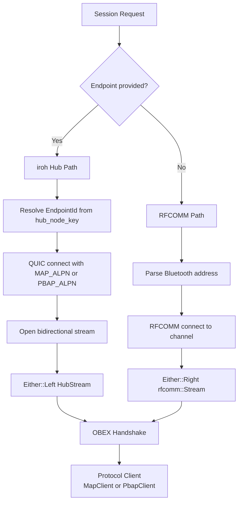

# Session Architecture

The session layer is the connective tissue between the transport abstraction and the protocol operations that imsg performs against a Bluetooth device. It sits above the raw transport (whether RFCOMM or iroh hub) and below the command handlers that callers invoke. Its responsibilities span three interconnected concerns: transport selection, OBEX session establishment, and error classification for retry decisions.

## Transport Selection: Two Paths to the Same Protocol

imsg supports two distinct transport mechanisms for reaching a MAP or PBAP server on a device. The traditional path uses raw RFCOMM over Bluetooth, establishing a direct connection to the device's RFCOMM channel. The modern path tunnels the same protocols over QUIC through an iroh hub, enabling connectivity when the device is not directly reachable via Bluetooth.

The selection between these paths happens in `conn.rs`, in the `target()` function. This function examines whether an iroh `Endpoint` is provided:

```rust
fn target(
    hub: bool,
    hub_node_key: Option<&str>,
    device_override: Option<&str>,
    device_addr: &str,
    channel: u8,
) -> Result<Target> {
    if hub {
        Ok(Target::Hub(resolve_hub_id(hub_node_key)?))
    } else {
        let addr_str = device_override.unwrap_or(device_addr);
        let addr = addr_str
            .parse::<bluer::Address>()
            .with_context(|| format!("invalid device address: {addr_str}"))?;
        Ok(Target::Rfcomm(addr, channel))
    }
}
```

The `hub` boolean is derived from `endpoint.is_some()` — when the caller provides an iroh endpoint, the hub path is taken. This is not a runtime fallback or automatic failover; it is a deliberate configuration decision made before any connection attempt.

The two paths are unified through `tokio_util::either::Either<HubStream, bluer::rfcomm::Stream>`, defined as the `Stream` type in `conn.rs`. Both `MapClient` and `PbapClient` are generic over any `AsyncRead + AsyncWrite`, so once the transport is selected, the remainder of the session code is transport-agnostic.



## OBEX Session Establishment

Both MAP and PBAP are built on OBEX (Object Exchange), a session-oriented protocol that begins with a CONNECT handshake. The session layer encapsulates this handshake so callers receive a fully initialized client ready for operations.

### MAP Session Establishment

For MAP, the handshake is more involved than just OBEX CONNECT. The `lifecycle::establish_map_session()` function performs two steps:

1. **OBEX CONNECT** — establishes the session with the MAP server
2. **Notification Registration** — enables the Message Notification Service so the device pushes event reports when messages arrive, change, or are deleted

```rust
pub async fn establish_map_session<T: AsyncRead + AsyncWrite + Unpin>(
    stream: T,
) -> Result<MapClient<T>, SessionError> {
    let mut client = MapClient::connect(stream).await.inspect_err(|e| {
        tracing::warn!("MAP session: OBEX CONNECT failed: {e}");
    })?;
    tracing::debug!("MAP session: OBEX CONNECT ok, registering notifications");
    client.set_notification_registration(true).await.inspect_err(|e| {
        tracing::warn!("MAP session: notification registration failed: {e}");
    })?;
    tracing::debug!("MAP session: notification registration ok");
    Ok(client)
}
```

The notification registration is critical: without it, the device will not push event reports, and the watch loop (which drives incremental sync and outbox drain) would have no events to process. The comment in `conn.rs` notes that "iOS drops the notification registration on OBEX DISCONNECT" — the caller must hold the returned client alive for as long as notifications are needed.

### PBAP Session Establishment

PBAP uses a simpler OBEX CONNECT handshake. The `PbapClient::connect()` method handles it directly in `connect_pbap_inner()`, with no additional post-connect steps required:

```rust
Target::Hub(id) => {
    let ep = endpoint
        .ok_or_else(|| anyhow::anyhow!("internal: hub target requires an endpoint"))?;
    let conn = ep.connect(id, PBAP_ALPN).await.context("iroh connect (PBAP)")?;
    let (send, recv) = conn.open_bi().await.context("iroh open_bi (PBAP)")?;
    let stream: Stream = Either::Left(HubStream::new(tokio::io::join(recv, send), conn));
    PbapClient::connect(stream).await.context("establishing PBAP session over iroh")
}
```

The iroh path uses application-layer protocol negotiation (ALPN) to distinguish MAP (`MAP_ALPN`) from PBAP (`PBAP_ALPN`) on the same QUIC connection, while the RFCOMM path relies on separate RFCOMM channels discovered via SDP.

## Error Classification for Retry Decisions

When a session operation fails, the caller must decide whether to retry. Retrying a permanent failure (wrong channel, authentication denied) wastes resources and delays error reporting. Failing fast on a transient failure (link blip, device temporarily out of range) abandons a recoverable session prematurely.

The session layer provides this decision logic in `retry.rs`, through the `classify()` function that returns a `Disposition` enum:

```rust
#[derive(Debug, Clone, Copy, PartialEq, Eq)]
pub enum Disposition {
    /// Recoverable (link timeout/reset, transient protocol hiccup) — retry with backoff.
    Transient,
    /// Non-recoverable (device refused, auth/pairing, bad input) — fail fast.
    Permanent,
}
```

### Classification Strategy

The classification inspects the innermost error rather than the top-level variant. This matters because a `SessionError::Map(MapError::Transport(TransportError::Io(io::Error)))` wraps an I/O error inside a MAP error inside a session error. The retry logic needs to reach through these layers:

```rust
pub fn classify(e: &SessionError) -> Disposition {
    match e {
        SessionError::Transport(t) => classify_transport(t),
        SessionError::Map(m) => classify_map(m),
        SessionError::Pbap(_) => Disposition::Transient,
    }
}
```

For MAP errors, the classification distinguishes:

- **Permanent**: `ObexError::ConnectRejected`, `ServerError`, `InvalidInput` — these indicate the server refused the operation, and retrying will not change the refusal
- **Transient**: everything else, including transport errors and unexpected EOF

For transport errors, the classification examines the `io::ErrorKind`:

```rust
const fn classify_io(kind: io::ErrorKind) -> Disposition {
    match kind {
        // No service on the channel, auth denied, or a malformed address — all permanent.
        io::ErrorKind::ConnectionRefused
        | io::ErrorKind::PermissionDenied
        | io::ErrorKind::InvalidInput => Disposition::Permanent,
        _ => Disposition::Transient,
    }
}
```

The default-to-transient policy is deliberate. The comment explains: "Anything not explicitly recognised defaults to `Disposition::Transient`: the retry budget bounds the cost of a wrong guess, whereas a wrong 'permanent' verdict abandons a recoverable link."

### Backoff Schedule

The retry logic also provides a backoff schedule generator:

```rust
pub fn backoff(
    initial: Duration,
    max: Duration,
    max_attempts: u32,
) -> impl Iterator<Item = Duration> + Clone {
    // ...
    ExponentialBackoff::from_millis(2).factor(factor).max_delay(max).take(gaps)
}
```

This uses exponential backoff without jitter. The absence of jitter is a deliberate choice: "the kernel-atomic bind election guarantees one broker per device, so there is no thundering herd to spread." Since only a single actor (the broker) retries against a given device, adding jitter would only increase latency without providing any coordination benefit.

## Session Error Taxonomy

The session layer defines its own error enum that unifies errors from the three protocol layers:

```rust
pub enum SessionError {
    /// OBEX MAP layer; either CONNECT failed or a command was rejected.
    #[error("MAP session error: {0}")]
    Map(#[from] MapError),
    /// OBEX PBAP layer; CONNECT failed or command rejected.
    #[error("PBAP session error: {0}")]
    Pbap(#[from] PbapError),
    /// RFCOMM or pre-OBEX I/O failure.
    #[error("transport error: {0}")]
    Transport(#[from] TransportError),
}
```

This unified error type flows through the session layer, but callers outside the session layer (in imsg-broker, for example) receive `anyhow::Error` for flexibility. The session layer also provides `outbox::is_fatal_anyhow()` to detect when a MAP transport has died and no further operations will succeed on that session:

```rust
pub fn is_fatal_anyhow(e: &anyhow::Error) -> bool {
    e.chain().filter_map(|cause| cause.downcast_ref::<MapError>()).any(is_session_fatal)
}
```

## Architectural Relationships

The session layer's position in the system can be understood by tracing the dependencies:

- **Below**: `transport` crate provides `rfcomm::connect` and iroh `Endpoint::connect`
- **Same level**: `map_core` and `pbap_core` provide protocol clients (`MapClient`, `PbapClient`) and event types
- **Above**: imsg-broker drives the session lifecycle with retry loops; the CLI commands invoke session functions directly for one-shot operations

The session layer does not own the retry loop itself — that lives in imsg-broker. Instead, it provides the classification and backoff policies that the broker consumes. This separation keeps the session layer focused on its core responsibilities: transport selection, OBEX handshakes, and error classification.

## Related Concepts

- [Transport Architecture](./transport-architecture.md) — details on RFCOMM and iroh hub transport implementation
- [Broker Lifecycle](./broker-lifecycle.md) — how the broker drives session creation, retry, and teardown
- [MNS and Event Handling](./mns-events.md) — the notification service that complements the session layer