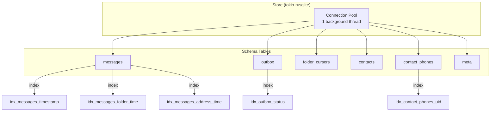

# Message Storage Architecture

The `imsg-store` crate provides an encrypted, persistent message store built on SQLCipher. It serves as the foundation for all message, contact, and sync-state persistence in the imsg system. Understanding its design requires examining how it balances several competing concerns: encryption at rest, efficient querying across multiple folders, reliable outgoing message lifecycle management, and contact-aware thread aggregation.

## Database Foundation

At its core, the store wraps a single `tokio-rusqlite` connection to a SQLCipher database. This choice was driven by several practical considerations. SQLCipher provides transparent AES-256 encryption with a caller-supplied key, ensuring that messages stored on disk are never exposed in plaintext. The `tokio-rusqlite` layer moves all database operations onto a dedicated background thread, preventing blocking in async contexts while preserving Rust's ownership model through move semantics.

The store is opened with a 32-byte key passed as a `SecretBox`, which is zeroed after the SQLCipher PRAGMA is issued. This ordering is significant: the key must be the first operation on a fresh connection, before WAL mode or foreign key enforcement. The migration runner executes immediately after connection setup, ensuring the schema is always consistent with the binary version.



## Schema Design and Evolution

The schema has evolved through six migrations, each adding capability without breaking existing data. The initial schema (V1) established the `messages` table with core fields: `map_handle` as the unique identifier from the MAP protocol, `timestamp_ms` for ordering, `folder` to track MAP folder paths, `direction` to distinguish received from sent messages, and `address` for the remote phone number.

Indexes were added strategically: `idx_messages_timestamp` supports time-range queries and catch-up synchronization, `idx_messages_folder_time` enables folder-scoped listings, and `idx_messages_address_time` supports per-conversation queries. These indexes reflect the access patterns observed in MAP-based synchronization, where messages are typically fetched by folder or by conversation.

V2 introduced the outbox and per-folder cursors. The outbox table tracks every outgoing intent with a lifecycle state machine (`queued` → `sending` → `sent` | `failed` | `unknown`). The `folder_cursors` table replaced a single global sync anchor with per-folder tracking, allowing partial folder syncs without corrupting progress in other folders. This was a response to observed failure modes where a long-running folder sync would block all progress tracking.

V3 added the contact cache, keyed on the durable vCard UID rather than the volatile PBAP list handle. The `contact_phones` table stores phone numbers with a primary key on `address`, ensuring a phone number cannot fan out across multiple contacts—a constraint that protects the thread aggregation query from producing duplicate or ambiguous results.

V5 and V6 added canonical E.164 forms alongside the raw device-reported addresses. The design decision to store both forms—rather than normalizing on write—reflects a pragmatic approach to incremental migration. Existing rows retain NULL for the canonical form and are populated on subsequent sync cycles. Reads use `COALESCE(address_e164, address)` to prefer the canonical form when available, falling back to raw when not.

## Message Representation

Messages are represented through two primary types: `NewMessage` for ingestion and `MessageRow` for retrieval. The distinction is subtle but important. `NewMessage` includes a caller-controlled `synced_at` timestamp, representing when the sync worker fetched the message. `MessageRow` reads this value back from the database, along with an auto-assigned `rowid` that provides a stable, monotonically increasing identifier within the database.

The `outgoing_status` field is nullable, present only for messages created via the outbox system. This design avoids polluting received messages with outgoing state while allowing sent messages to carry fine-grained delivery tracking. The field uses an enum with states ranging from `queued` through `sent_unconfirmed` to `sent_confirmed`, with separate failure categories for retryable and permanent errors.

## Folder Organization

Messages are organized by MAP folder paths stored in the `folder` column. The store does not impose a rigid folder hierarchy; instead, it treats folders as opaque strings passed from the MAP protocol. Common values include `telecom/msg/inbox`, `telecom/msg/sent`, and `telecom/msg/draft`. This flexibility allows the store to accommodate any folder structure the device exposes without schema changes.

The per-folder cursor mechanism tracks sync progress independently for each folder. Each cursor stores `last_sync_at` (the timestamp of the last completed sync), `highest_ts` (the highest timestamp seen in the most recent sync, used as the next pull boundary), and `sync_status` (indicating whether the last sync completed, is in progress, or failed). This design ensures that a failed sync on one folder does not block progress on others, and the `highest_ts` value prevents re-fetching messages on subsequent attempts.

## Read Paths and Query Design

The store exposes several read paths optimized for different access patterns. Point lookup by `map_handle` uses a cached prepared statement with a unique index hit. List queries support filtering by folder, read status, address, and time range, always ordered by `timestamp_ms DESC` for newest-first presentation.

The thread aggregation query deserves particular attention. It groups messages by canonical address (using `COALESCE(address_e164, address)`), counts total messages and unread received messages, and joins against the contact cache to attach display names. The query is computationally expensive—it cannot use the existing indexes because the grouping expression involves a function—but it is bounded by the number of distinct conversations, making it acceptable for UI presentation.

```sql
SELECT COALESCE(m.address_e164, m.address) AS addr,
       MAX(m.timestamp_ms) AS latest_ms,
       COUNT(*) AS total,
       SUM(CASE WHEN m.status = 0 AND m.direction = 0 THEN 1 ELSE 0 END) AS unread,
       (SELECT m2.outgoing_status FROM messages m2
        WHERE COALESCE(m2.address_e164, m2.address) = COALESCE(m.address_e164, m.address)
        ORDER BY m2.timestamp_ms DESC LIMIT 1) AS latest_outgoing_status,
       c.display_name AS contact_name
FROM messages m
LEFT JOIN contact_phones cp ON COALESCE(cp.address_e164, cp.address) = COALESCE(m.address_e164, m.address)
LEFT JOIN contacts c ON c.uid = cp.uid
WHERE m.address != ''
GROUP BY COALESCE(m.address_e164, m.address) ORDER BY latest_ms DESC
```

The subquery for `latest_outgoing_status` is necessary because aggregate functions cannot directly select the non-aggregated column from the row with the maximum timestamp. While this could be expressed as a window function in newer SQLite versions, the current approach remains compatible with the minimum supported SQLite version.

## Outgoing Message Lifecycle

The outbox system manages the complete lifecycle of outgoing messages from user initiation through device acknowledgment. When a user sends a message, `Store::enqueue_send` atomically creates two rows: a speculative `messages` row with a placeholder handle of the form `local:{outbox_id}`, and an `outbox` entry linking the command (e.g., `send_sms`), serialized payload, and lifecycle state.

This speculative approach provides several benefits. The user sees their message immediately in the UI without waiting for device acknowledgment. The placeholder handle allows the message to participate in thread aggregation and listing queries. If the device acknowledges the push successfully, `Store::promote_outgoing` replaces the placeholder with the real MAP handle and advances the outgoing status.

The lifecycle includes an `unknown` state for the ambiguous case where the connection drops after a push is initiated but before acknowledgment is received. The store cannot determine whether the message was delivered or lost, so it records this uncertainty. Reconciliation against the device Sent folder during subsequent backfill resolves `unknown` states: if the message appears in the Sent folder, it is promoted to `sent_confirmed`; if the backfill completes without finding it, the state can be treated as failed.

The `complete_send` method demonstrates transactional consistency: it updates both the outbox entry and the message row in a single SQLite transaction, ensuring that either both writes succeed or neither is visible. This prevents the inconsistent state where the outbox shows `sent` but the message still carries the placeholder handle.

## Contact Cache Integration

The contact cache serves two purposes in the message store: display name resolution for thread listings and address canonicalization for matching. Contacts are keyed by vCard UID, which is stable across PBAP listings, unlike the volatile PBAP list handle that the device reassigns on every pull.

Phone numbers are stored in `contact_phones` with both raw and canonical forms. The primary key constraint on `address` ensures that a single phone number maps to exactly one contact, which is essential for the thread aggregation query to produce deterministic results. The foreign key with `ON DELETE CASCADE` ensures that deleting a contact removes its associated phone rows.

The `lookup_contact` method demonstrates the canonical address matching: it queries using `COALESCE(address_e164, address)` to match on the normalized form when available, falling back to raw string equality. Callers are expected to pass an already-canonical address so that formatting differences do not cause missed matches.

## Design Trade-offs

Several design decisions reflect explicit trade-offs. Storing both raw and canonical address forms was chosen over normalizing on write to avoid a migration of existing data and to handle cases where normalization fails. The trade-off is that reads must use `COALESCE` expressions that prevent index usage in some queries.

The per-folder cursor design adds complexity compared to a single global anchor but provides resilience against partial sync failures. The trade-off is that determining overall "freshness" requires aggregating across all folders, which `Store::latest_sync_at` handles by taking the maximum `last_sync_at` value.

The thread aggregation query's computational cost is accepted because it runs infrequently (on UI refresh or app launch) and is bounded by conversation count. More aggressive caching or denormalization was considered but rejected to keep the schema simple and the store predictable.

## Error Handling Philosophy

The store exposes a narrow error taxonomy: `Database` for file-level failures, `Connection` for async dispatch or SQLite errors, `Migration` for schema version mismatches, and `InvalidTransition` for outbox state machine violations. This simplicity reflects the store's role as a low-level primitive—it does not attempt to interpret business logic errors, leaving that to higher layers.

Silent no-ops are used extensively: upserts ignore existing handles, updates and deletes no-op if the handle is absent, and status promotions no-op if the row does not match the expected source state. This behavior simplifies the caller by removing the need to check existence before operations, though it does mean that some errors manifest as no observable effect rather than explicit failure.

## Related Concepts

- The [Sync Architecture](./sync-cursors.md) page covers how the store interacts with MAP protocol synchronization, including folder backfill and push operations.
- The [Contact Synchronization](./contact-caching.md) page details how PBAP contacts are fetched, normalized, and cached.
- The [Outbox Worker](./outbox-lifecycle.md) page explains the background worker that drains queued outbox entries and handles retry logic.