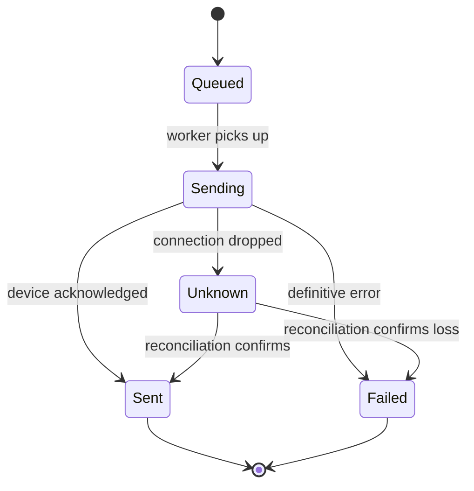
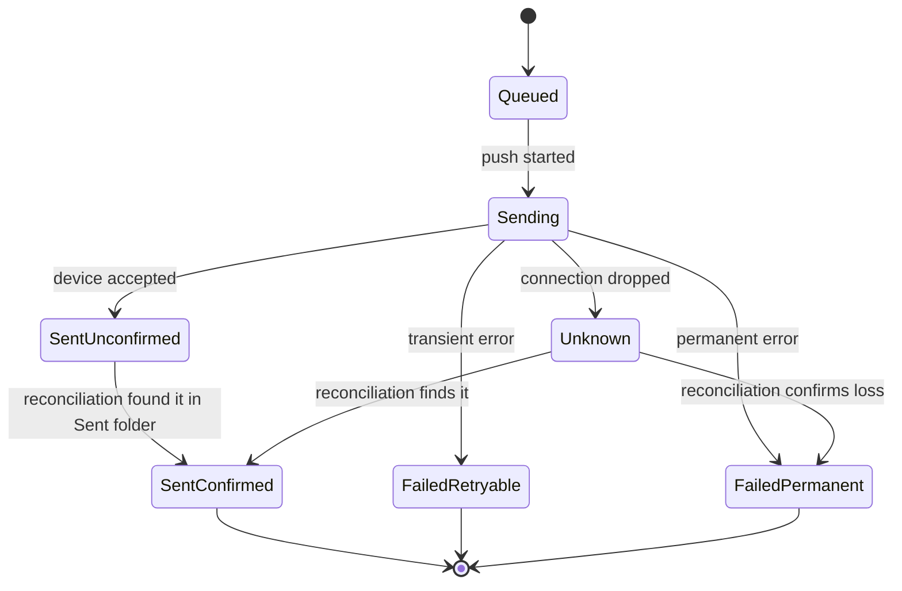

# Outbox and Outgoing Lifecycle

The outbox and outgoing message lifecycle addresses a fundamental challenge in mobile messaging synchronization: the network is unreliable, devices may disconnect mid-operation, and the local client must eventually reconcile its view of sent messages with what the remote device actually recorded. This page explains how the store models this lifecycle, why it uses two parallel state machines, and how speculative sends interact with reconciliation against the device Sent folder.

## The Problem Space

When a user sends a message through imsg, the operation traverses several failure-prone stages:

1. The client creates a local record representing the message the user wants to send
2. The client initiates a push to the device over Bluetooth
3. The device may accept the message, reject it, or drop the connection mid-transfer
4. If accepted, the device assigns a real MAP handle that uniquely identifies the message in its folders
5. The device eventually syncs its Sent folder back to the client, confirming the message exists

At each step, the client must maintain enough state to make progress when connectivity resumes, to retry transient failures, and to distinguish permanent failures from ambiguous ones. The outbox and outgoing lifecycle provides this state management.

## Two Parallel State Machines

The system maintains two related but distinct state machines: one for outbox entries and one for outgoing message rows in the messages table. This separation reflects the different concerns of *intent* versus *result*.

### Outbox State Machine (OutboxStatus)

The outbox table serves as a durable queue of outgoing operations. Each row records a command (e.g., `"send_sms"`), its serialized payload, and a status that tracks the operation's progress:



The states are defined in `row/outbox.rs`:

- **Queued**: Waiting for the sync worker to attempt the push
- **Sending**: Push initiated; awaiting device acknowledgement
- **Sent**: Device acknowledged the push successfully
- **Failed**: Push failed with a definitive error; will not be retried automatically
- **Unknown**: Connection dropped mid-push; outcome requires reconciliation to determine

The key insight behind the `Unknown` state is that when a Bluetooth connection drops after a push was initiated but before acknowledgement was received, the client simply does not know what happened. The message may have reached the device, or it may have been lost. This ambiguity cannot be resolved locally—it requires checking the device's Sent folder during the next sync.

### Outgoing Message State Machine (OutgoingStatus)

The messages table carries a parallel `outgoing_status` column for rows representing outgoing messages. This state tracks the delivery narrative from the user's perspective:



These states live in `row/outbox.rs`:

- **Queued**: Outbox entry created; push not yet attempted
- **Sending**: Push in progress
- **SentUnconfirmed**: Device accepted the push; not yet confirmed by the Sent folder
- **SentConfirmed**: Confirmed present in the device Sent folder via reconciliation
- **FailedRetryable**: Push failed with a transient error; a retry is warranted
- **FailedPermanent**: Push failed with a permanent error; no retry will be attempted
- **Unknown**: Connection dropped mid-push; outcome requires reconciliation to determine

The distinction between `SentUnconfirmed` and `SentConfirmed` matters because device push acceptance is not the same as device persistence. A message may be accepted into a device's outgoing queue but never actually written to the Sent folder (for example, if the send fails locally on the device). Reconciliation provides the authoritative answer.

## Speculative Message Creation

When a user initiates a send, the client does not wait for device confirmation before creating a local message row. Instead, it performs a *speculative insert*—creating both an outbox entry and a messages row in a single atomic transaction, using a placeholder handle:

```rust
// From outgoing.rs - enqueue_send performs atomic speculative insert
let placeholder = format!("local:{outbox_id}");
// Inserts messages row with placeholder handle...
// Links outbox.local_message_id to the message rowid...
```

This design serves several purposes:

1. **Immediate feedback**: The user sees their message in the UI immediately, without waiting for Bluetooth round-trips
2. **Unique identification**: The placeholder `"local:{outbox_id}"` is guaranteed unique and can be used to look up the row before the real handle is known
3. **Atomicity**: Both the outbox entry and the message row are created in a single SQLite transaction, so the system is never in a state where one exists without the other

The placeholder handle is later replaced by the real MAP handle when the device acknowledges the push, via the `promote_outgoing` method. This handle promotion is also transactional—`complete_send` atomically resolves the outbox entry to `Sent` and updates the message's handle and status together.

## Reconciliation Against the Device Sent Folder

The reconciliation process is what resolves `Unknown` states and confirms `SentUnconfirmed` messages. When the sync worker backfills the device's Sent folder, it checks each incoming sent message against local speculative rows:

```rust
// From outgoing.rs - reconcile_outgoing
// Called when a device Sent message matches a local speculative row
// Advances outgoing_status from sent_unconfirmed to sent_confirmed
```

The matching is performed by the caller (typically the sync worker), which compares the device-reported message properties against local speculative rows. When a match is found, `reconcile_outgoing` updates the local row's status to `SentConfirmed`.

For outbox entries stuck in `Unknown`, reconciliation effectively promotes them to either `Sent` (if the message appears in the Sent folder) or `Failed` (if it does not, after some grace period or retry policy).

## Transactional Guarantees

The store provides strong transactional guarantees around these operations, which is essential given the failure modes involved:

- **`enqueue_send`**: Atomically inserts the outbox entry, the speculative message row, and links them. Either both succeed or neither is written.
- **`complete_send`**: Atomically resolves the outbox entry to `Sent` and promotes the message handle from placeholder to real MAP handle. No partial state is visible.
- **`resolve`**: Updates the outbox status with appropriate timestamp fields (`attempted_at` for in-progress, `resolved_at` for terminal states).

These transactions prevent the system from entering inconsistent states where, for example, the outbox says a message was sent but the messages table still holds the placeholder handle.

## Foreign Key Considerations

The outbox table has a `local_message_id` column that references `messages(rowid)`. This creates a natural foreign key relationship. However, the system deliberately uses `ON DELETE SET NULL` for this relationship (added in migration V4):

```sql
-- From V4__outbox_message_fk_set_null.sql
local_message_id INTEGER REFERENCES messages(rowid) ON DELETE SET NULL
```

This design choice reflects the fact that the outbox entry is the durable audit trail—it should survive even if the message itself is deleted. The outbox preserves the command, payload, status, and timestamps regardless of what happens to the message row. Deleting a sent message should not prevent the system from remembering that a send operation occurred.

## Why Two Tables?

The separation of outbox (intent) and messages (result) may seem redundant, but it serves important purposes:

1. **Drain semantics**: The outbox is a queue that workers drain. Workers query for `status = queued`, process each entry, and update status. The messages table has no such queue semantics.

2. **Retry independence**: A message row may be updated or even deleted, but the outbox entry preserves the original command and payload for retry attempts.

3. **Audit trail**: The outbox records every outgoing operation with its complete history (`created_at`, `attempted_at`, `resolved_at`, `error`). This is separate from the message's own `synced_at` timestamp.

4. **Status divergence**: The outbox can be in `Unknown` while the message is in `SentUnconfirmed`, reflecting different aspects of the same underlying operation.

## Related Concepts

- The [Folder Sync and Cursors](folder-sync.md) page covers how the sync worker tracks progress and how reconciliation fits into the broader sync loop
- The [Message Storage](message-storage.md) page covers the messages table schema and read paths
- The [Error Handling](error-handling.md) page covers how the store surfaces connection and transition errors to callers

The outbox and outgoing lifecycle is one of the more intricate parts of the store because it must handle ambiguity gracefully. By maintaining two parallel state machines, using atomic transactions, and deferring to reconciliation for ambiguous cases, the system can make progress even under adverse network conditions while preserving a consistent internal model.