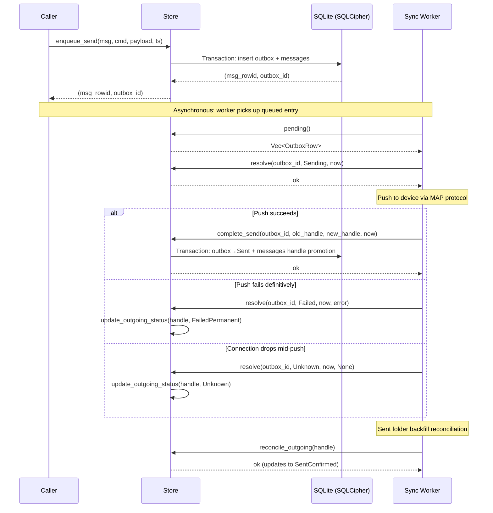

# Sending a Message

This page traces the complete flow of sending a message through the imsg-store system, from the initial speculative creation of a local message row through to confirmation that the message has been accepted by the device and persisted in the Sent folder.

## Operation Overview

The send operation involves several distinct phases that span the `Store` API, the outbox lifecycle, and the outgoing message state machine. The flow is designed to handle network uncertainty: the system must account for the possibility that a push succeeds, fails, or leaves the connection in an ambiguous state (connection drop mid-transfer).

**Starting conditions:** The caller has a validated `NewMessage` containing the recipient address, message text, timestamp, and folder destination. The `Store` is already open with an encrypted connection.

**Outcome:** A message row exists in the `messages` table with a confirmed MAP protocol handle, and the outbox entry has reached a terminal state (`sent`, `failed`, or `unknown`).

## Participating Components

| Component | Role |
|---|---|
| `Store` | Central database handle; wraps `tokio-rusqlite` connection |
| `outbox` table | Persistent queue of pending outgoing operations |
| `messages` table | Primary message storage with outgoing status tracking |
| `OutboxStatus` | Lifecycle state for outbox entries (`queued` → `sending` → terminal) |
| `OutgoingStatus` | Lifecycle state for outgoing messages (`queued` → `sent_unconfirmed` → `sent_confirmed`) |

## Flow Diagram



## Phase 1: Speculative Message Creation

The caller invokes `Store::enqueue_send`, passing a `NewMessage` struct, the command name (e.g., `"send_sms"`), a serialized payload, and a timestamp. This method performs an atomic operation within a single SQLite transaction:

1. **Outbox insertion:** An outbox entry is created with `status = Queued`. The auto-generated `outbox_id` becomes the basis for a placeholder handle.

2. **Speculative message row:** A `messages` row is inserted with a placeholder `map_handle` of the form `"local:{outbox_id}"`. This placeholder is unique and identifiable, allowing the row to be updated once the device assigns a real MAP handle.

3. **Linking:** The outbox entry is updated to set `local_message_id` to the message's rowid, creating a bidirectional link between the outbox intent and the message row.

```rust
// From outgoing.rs — enqueue_send atomically creates both rows
let placeholder = format!("local:{outbox_id}");
tx.execute(
    "INSERT INTO messages (map_handle, ...) VALUES (?1, ...)",
    params![placeholder, ...],
)?;
let msg_rowid = tx.last_insert_rowid();
tx.execute(
    "UPDATE outbox SET local_message_id = ?1 WHERE id = ?2",
    params![msg_rowid, outbox_id],
)?;
```

The method returns `(msg_rowid, outbox_id)` to the caller. At this point:
- The message exists in the `messages` table with a temporary handle
- The outbox entry is queued and waiting for the sync worker
- The `outgoing_status` on the message is `None` (or `Queued` if explicitly set)

## Phase 2: Outbox Processing

The sync worker (running asynchronously in the application layer) periodically calls `Store::pending()` to retrieve all outbox entries with `status = Queued`, ordered by `created_at` ascending. This ensures FIFO processing.

For each pending entry, the worker:
1. Calls `Store::resolve` with `OutboxStatus::Sending` to mark the entry as in-progress
2. Initiates the MAP protocol push to the device

The `resolve` method validates that the target status is not `Queued` (which would be a no-op), then updates the outbox row:

```rust
// From outbox.rs — resolve advances outbox state
let transition = match status {
    OutboxStatus::Queued => return Err(Error::InvalidTransition),
    OutboxStatus::Sending => Transition::InProgress,
    OutboxStatus::Sent | OutboxStatus::Failed | OutboxStatus::Unknown => {
        Transition::Terminal
    }
};
```

For `Sending`, the `attempted_at` timestamp is set. For terminal states, `resolved_at` is set instead.

## Phase 3: Push Outcome and Handle Promotion

When the MAP protocol push completes, the worker must reconcile the outcome with the store. Three paths are possible:

### Path A: Push Succeeded

The device returns a real MAP handle (e.g., `"telecom/msg/12345abc"`). The worker calls `Store::complete_send`, which performs a single transaction:

1. **Outbox resolution:** The outbox entry transitions to `Sent` with `resolved_at = now_ms` and `error = NULL`.
2. **Handle promotion:** The message's `map_handle` is renamed from `"local:{outbox_id}"` to the real handle, and `outgoing_status` is set to `SentUnconfirmed`.

```rust
// From outgoing.rs — complete_send atomically resolves and promotes
tx.execute(
    "UPDATE outbox SET status = ?1, resolved_at = ?2 WHERE id = ?3",
    params![OutboxStatus::Sent, now_ms, outbox_id],
)?;
tx.execute(
    "UPDATE messages SET map_handle = ?1, outgoing_status = ?2 \
     WHERE map_handle = ?3",
    params![new_handle, OutgoingStatus::SentUnconfirmed, old],
)?;
```

### Path B: Push Failed

If the device rejects the message with a definitive error, the worker calls `Store::resolve` with `OutboxStatus::Failed` and optionally calls `Store::update_outgoing_status` to mark the message as `FailedPermanent`. The outbox entry reaches a terminal state and will not be retried.

### Path C: Ambiguous Outcome (Connection Drop)

If the connection drops after the push was initiated but before acknowledgement was received, the worker calls `Store::resolve` with `OutboxStatus::Unknown`. The message's `outgoing_status` is set to `Unknown`, indicating that reconciliation against the device Sent folder is required to determine the true outcome.

## Phase 4: Sent Folder Reconciliation

The `SentUnconfirmed` and `Unknown` states exist because MAP push acknowledgements do not guarantee the message has been persisted to the device's Sent folder. The sync worker performs a Sent folder backfill during its normal sync cycle.

When the backfill encounters a sent message that matches a local speculative row (by address, timestamp, and text), it calls `Store::reconcile_outgoing` with the confirmed MAP handle:

```rust
// From outgoing.rs — reconcile confirms the message in Sent folder
conn.prepare_cached(
    "UPDATE messages SET outgoing_status = 'sent_confirmed' \
     WHERE map_handle = ?1 AND outgoing_status = 'sent_unconfirmed'",
)?
.execute([handle.as_str()])?;
```

This advances `outgoing_status` from `SentUnconfirmed` to `SentConfirmed`, confirming that the device has successfully persisted the message.

## State Transitions Summary

```
Outbox Status:
  queued → sending → sent        (success)
  queued → sending → failed      (definitive error)
  queued → sending → unknown     (connection drop)

Outgoing Status (messages table):
  None/Queued → Sending          (push initiated)
  Sending → SentUnconfirmed      (push acknowledged)
  SentUnconfirmed → SentConfirmed (Sent folder reconciliation)
  Sending → FailedRetryable      (transient error, will retry)
  Sending → FailedPermanent      (definitive error)
  Sending → Unknown              (connection drop, needs reconciliation)
```

## Failure Conditions

| Phase | Failure | Effect |
|---|---|---|
| `enqueue_send` | Database transaction error | Neither outbox nor message row is written; caller receives error |
| `resolve` to `Sending` | Connection error | Outbox remains `queued`; worker will retry on next poll |
| `complete_send` | Transaction failure | Neither outbox nor message is updated; handle promotion is lost — caller must detect and recover |
| `resolve` to terminal | Connection error | Outbox may remain `sending`; worker retries on next poll |
| `reconcile_outgoing` | No matching row | No-op; the message may not have been sent, or may use a different handle |

## Resulting State

After a successful send flow:

- The `messages` table contains a row with a real MAP `map_handle` (not a `local:` placeholder)
- The `outgoing_status` is `SentConfirmed` (or `SentUnconfirmed` if reconciliation hasn't run yet)
- The `outbox` entry has `status = Sent` and a non-null `resolved_at` timestamp
- The bidirectional link between `outbox.local_message_id` and the message rowid is preserved

The message is now visible in queries against the Sent folder and can be correlated with future Sent folder backfills using its confirmed handle.