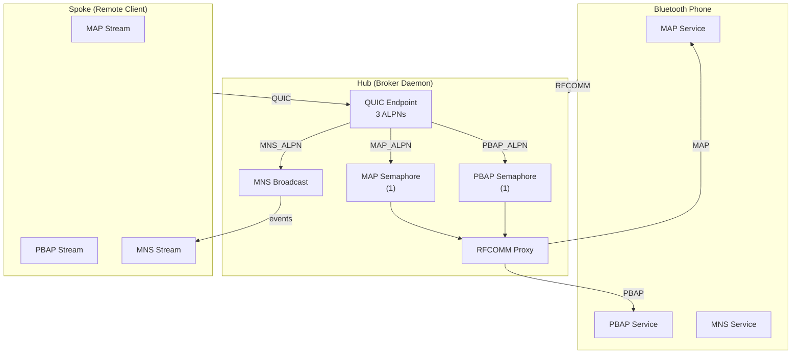

# iroh QUIC Hub/Spoke Transport

The iroh QUIC transport replaces the previous TCP bridge for connecting to remote machines. Where the TCP bridge assumed a direct network path between client and server, the hub/spoke model introduces a relay-friendly architecture that works across NAT, firewalls, and variable network conditions—while preserving the Bluetooth RFCOMM semantics that the OBEX profiles expect.

## Why a Hub/Spoke Architecture?

The original TCP bridge assumed that a client could reach the broker daemon directly over the network. This works well when both run on the same machine or within the same trusted network, but breaks down for remote access scenarios: mobile devices behind carrier NAT, home networks with dynamic IPs, or enterprise environments with restrictive firewalls.

The hub/spoke model inverts this relationship. Instead of the client reaching inward to the broker, the broker runs as a **hub** that owns the Bluetooth RFCOMM link and exposes itself as a QUIC endpoint. Remote clients become **spokes** that connect outward to the hub over QUIC. Outbound connections traverse NAT and firewalls naturally, and the iroh library provides relay fallback when direct connectivity isn't available.

This design also maps cleanly onto the Bluetooth profile semantics:

- **MAP** (Message Access Profile) and **PBAP** (Phone Book Access Profile) are request/response protocols—spokes send OBEX requests, the hub proxies them to RFCOMM, and responses flow back.
- **MNS** (Message Notification Service) is an event push channel—the phone pushes notifications to the hub, which fans them out to all connected spokes.

## The Hub: RFCOMM Ownership and QUIC Acceptance

The hub lives in `hub.rs` and is initialized via [`run_hub`]. Its responsibilities are:

1. **Bind a QUIC endpoint** with three ALPN protocols advertised: `imsg-map/1`, `imsg-pbap/1`, and `imsg-mns/1`.
2. **Accept incoming QUIC connections** from spokes.
3. **Route each connection by ALPN** to the appropriate handler.
4. **Proxy MAP/PBAP streams** to the Bluetooth device over RFCOMM.
5. **Fan out MNS events** to all subscribed spokes.

### RFCOMM Channel Semantics

The hub is configured with the Bluetooth device address and the RFCOMM channels for MAP and PBAP. These are resolved at startup via SDP (Service Discovery Protocol) using the code in `discover.rs`. The MNS channel is fixed at 17 per the MAP specification.

Critically, **only one active OBEX session per profile can exist at a time**. The MAP and PBAP channels each have a semaphore that permits exactly one concurrent proxy:

```rust
let map_sem = Arc::new(Semaphore::new(1));
let pbap_sem = Arc::new(Semaphore::new(1));
```

When a spoke connects for MAP, it acquires the semaphore permit, opens a bidirectional QUIC stream, and proxies it to the RFCOMM channel. Other MAP spokes queue behind the semaphore until the first session completes. This serialization matches the Bluetooth specification's expectation of a single OBEX connection per profile.

### MNS Event Distribution

MNS works differently. The hub receives a `broadcast::Sender<Bytes>` from the session layer (where the RFCOMM MNS listener lives). Each connected MNS spoke subscribes to this broadcast channel. When a notification arrives from the phone, the hub writes it to every active MNS stream:

```rust
async fn stream_mns(
    conn: Connection,
    mut events: broadcast::Receiver<Bytes>,
    mut cancel: watch::Receiver<bool>,
) -> Result<(), TransportError> {
    let (mut send, _recv) = conn.accept_bi().await.map_err(iroh_err)?;
    loop {
        tokio::select! {
            _ = cancelled(&mut cancel) => break,
            event = events.recv() => match event {
                Ok(payload) => {
                    let len = u32::try_from(payload.len())?;
                    send.write_all(&len.to_be_bytes()).await.map_err(iroh_err)?;
                    send.write_all(&payload).await.map_err(iroh_err)?;
                }
                // ...
            },
        }
    }
    Ok(())
}
```

Each event is framed as a 4-byte big-endian length prefix followed by the raw event-report bytes. This explicit framing lets the spoke read exactly one event at a time without needing delimiters in the payload itself.

## The Spoke: Outbound QUIC Connections

Spokes are clients that connect to the hub. The spoke side lives in `spoke.rs` and provides three connection functions:

- [`connect_map_hub`] — opens a MAP request stream
- [`connect_pbap_hub`] — opens a PBAP request stream  
- [`connect_mns_hub`] — subscribes to MNS notifications

Each function takes an `Endpoint` (created by [`bind_spoke`]) and a hub address. The hub address can be an `EndpointId` (resolved via iroh's discovery/relay system) or a full `EndpointAddr` with direct addresses.

### ALPN Protocol Selection

The ALPN (Application-Layer Protocol Negotiation) field in the QUIC handshake determines which profile the connection is for:

```rust
const MAP_ALPN: &[u8] = b"imsg-map/1";
const PBAP_ALPN: &[u8] = b"imsg-pbap/1";
const MNS_ALPN: &[u8] = b"imsg-mns/1";
```

When the hub receives an incoming connection, it extracts the ALPN and dispatches to the appropriate handler. This design ensures that a single QUIC endpoint can multiplex all three profiles without port or path confusion.

### MNS Subscription Semantics

The MNS connection is unusual in that it's **spoke-initiated but hub-to-spoke only**. The spoke opens a bidirectional stream but immediately drops its send half:

```rust
let (_send, recv) = conn.open_bi().await.map_err(iroh_err)?;
Ok(HubRecvStream::new(recv, conn))
```

Dropping the send half sends a `STOP_SENDING` frame on the QUIC stream, signaling to the hub that no data will flow in that direction. This is both semantically correct (MNS events only go phone→hub→spoke) and a clean way to express intent in the protocol.

## Stream Ownership and Connection Lifetime

A subtle but important design concern is **when the QUIC connection closes**. In iroh, dropping a `Connection` tears down all streams through it immediately. The OBEX layer, however, expects the transport to live for the duration of the OBEX session—not just until the first request completes.

This is why `stream.rs` provides two wrapper types:

- **[`HubStream`]**: Wraps a `SpokeStream` (the joined recv/send halves) and owns the underlying `Connection`. When dropped, it calls `conn.close()` to tear down the QUIC connection.
- **[`HubRecvStream`]**: Same pattern for MNS—owns the `Connection` alongside the receive stream.

Both wrappers implement `AsyncRead` and `AsyncWrite` (or just `AsyncRead` for the receive-only MNS stream), so they plug directly into the OBEX framing layer via [`obex_core::wrap`]. The caller gets a clean async I/O interface, and the connection lifetime is tied to the wrapper's lifetime, not the stream's.

```rust
pub struct HubStream {
    inner: SpokeStream,
    conn: Connection,
}

impl Drop for HubStream {
    fn drop(&mut self) {
        self.conn.close(VarInt::from_u32(0), b"");
    }
}
```

## Key Management

The hub needs a persistent identity—its `SecretKey`—so spokes can find and trust it across restarts. The `key.rs` module provides [`load_or_create_key`], which:

1. Checks for an existing key file at the given path.
2. If found, validates it's exactly 32 bytes (the ed25519 seed size) and loads it.
3. If not found, generates a new key, writes it to the path with `0600` permissions (on Unix), and returns it.

The key is an iroh `SecretKey`, which is used both for QUIC identity and for iroh's node discovery system.

## Architectural Summary



The hub owns the Bluetooth link and speaks QUIC to the outside world. Each profile gets its own ALPN and, for MAP/PBAP, its own serialization semaphore. MNS events fan out to all connected spokes. The stream wrappers ensure the QUIC connection lives exactly as long as the OBEX session needs it.

This architecture replaces the TCP bridge while preserving the same OBEX semantics—spokes don't need to know they're talking to a QUIC endpoint rather than a direct Bluetooth connection. The hub handles the translation, and iroh handles the complexity of NAT traversal and relay fallback.